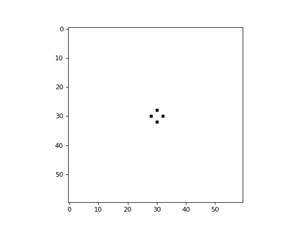
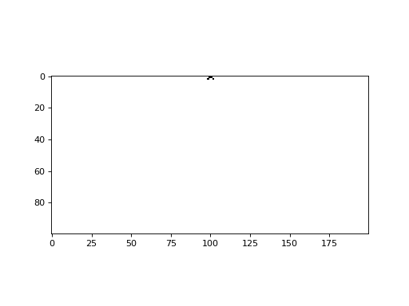
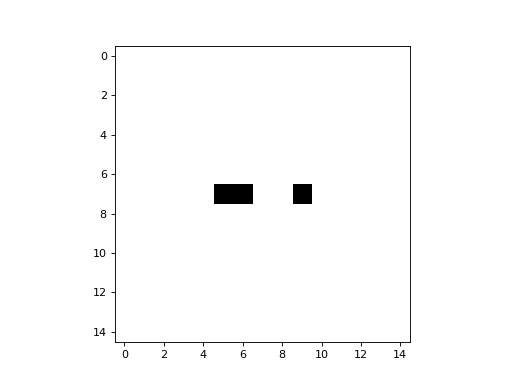

# Animating Network Automata

Network Automata can be animated with the Netomaton `animate_activities` function.

For example, the evolution of a 2D 60x60 Cellular Automaton can be
visualized using:
```python
ntm.animate_activities(trajectory, shape=(60, 60), interval=150)
```


The evolution of a 1D Celluar Automaton with 200 cells can be visualized
using:
```python
# note that the shape specified is a tuple containing only a single value
ntm.animate_activities(trajectory, shape=(200,))
```


Because a Network Automaton consists of a vector of activities at each
timestep, that vector can be reshaped and visualized however desired.
For example, the evolution of a 1D Cellular Automaton with 225 cells
can be visualized as if it were a 2D Cellular Automation, using:
```python
ntm.animate_activities(trajectory, shape=(15, 15), interval=100)
```


The full source code for these examples can be found [here](animation_demo.py).
