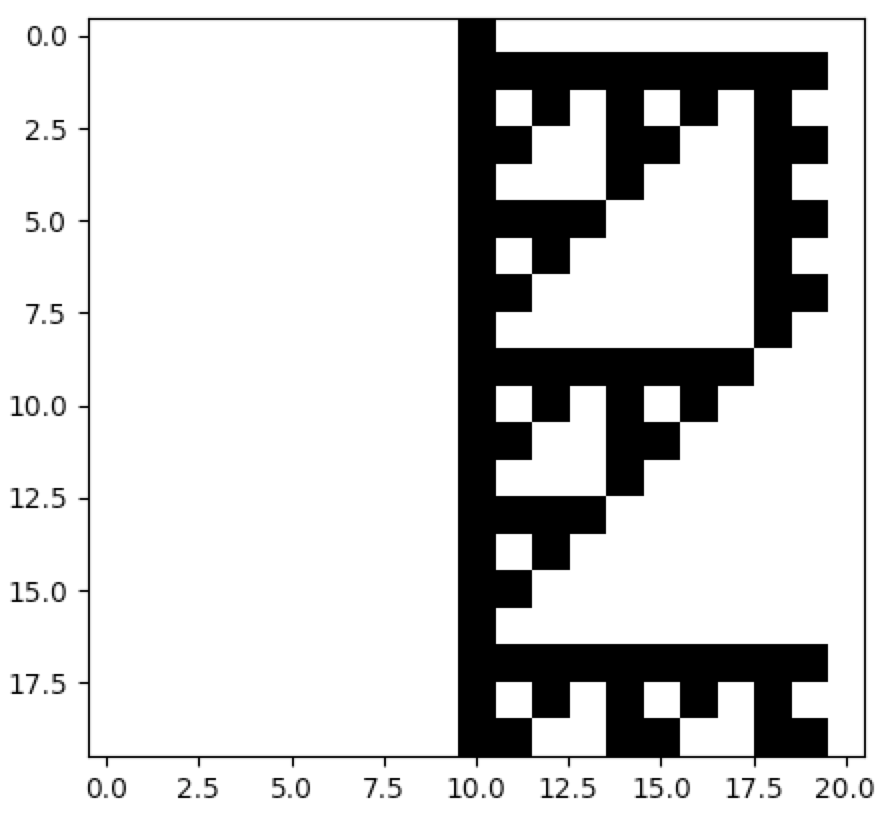

# Asynchronous Automata

Network Automata are usually processed synchronously. That is, each node's
state is based strictly on the activity of its neighbourhood in the previous
timestep. For this reason, it doesn't matter in what order the nodes are
updated. However, it is sometimes beneficial to update the states of the
nodes asynchronously. There are various ways to implement such behaviour,
but normally one specifies an update order for the nodes, or one allows the
nodes to be updated in a random order, such that a nodes's state is based
on the activity of its neighbourhood immediately. In practice, this means
that, in each "timestep", only a single node is updated. The "true" timestep
is complete once all nodes have been updated in an update cycle.

There are other ways to implement asynchronous dynamics in discrete
systems, but Netomaton supports the sequential kind of asynchronous updates,
described above, in the `AsynchronousRule` class.

The following example implements the elementary rule 60 sequential
automaton from Wolfram's NKS Notes on Chapter 9, section 10:
"Sequential cellular automata" (http://www.wolframscience.com/nks/notes-9-10--sequential-cellular-automata/):

```python
import netomaton as ntm

network = ntm.topology.cellular_automaton(n=21)

initial_conditions =[0]*10 + [1] + [0]*10

r = ntm.AsynchronousRule(activity_rule=ntm.rules.nks_ca_rule(60),
                         update_order=range(1, 20))

trajectory = ntm.evolve(initial_conditions=initial_conditions, network=network,
                        timesteps=19*20, activity_rule=r)

# plot every 19th row, including the first, as a cycle is completed every 19 rows
activities = ntm.get_activities_over_time_as_list(trajectory)
ntm.plot_grid(activities[::19])
```



The full source code for this example can be found [here](asynchronous_automata_demo.py).
