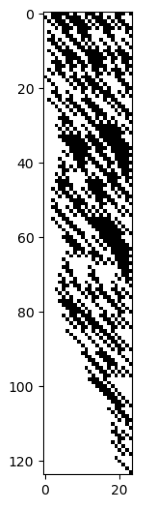
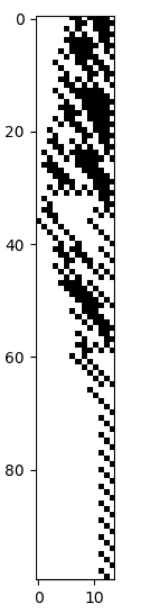

# Collatz Conjecture

The Collatz Conjecture states that by iteratively applying a particular rule to successive numbers, beginning from any 
number, the result will eventually be 1. 

The following example illustrates the use of the Netomaton input function to terminate an evolution dynamically, based 
on the value of the activities.

```python
import netomaton as ntm

network = ntm.topology.from_adjacency_matrix([[1]])

def activity_rule(ctx):
    n = ctx.current_activity
    if n % 2 == 0:
        # number is even
        return n / 2
    else:
        return  3*n + 1

def input(t, activities, n):
    if activities[0] == 1:
        return None
    return 1

initial_conditions = [4103453]

trajectory = ntm.evolve(network=network, initial_conditions=initial_conditions,
                        activity_rule=activity_rule, input=input)

activities = ntm.get_activities_over_time_as_list(trajectory)

# convert the numbers to binary lists and left-pad with zeroes, so we can plot them
activities = ntm.binarize_for_plotting(activities)

ntm.plot_grid(activities)
```



The full source code for this example can be found [here](collatz_conjecture_demo.py).

The following example utilizes a fixed number of timesteps as a comparison against using the input function instead.

```python
import netomaton as ntm

network = ntm.topology.from_adjacency_matrix([[1]])


def activity_rule(ctx):
    n = ctx.current_activity
    if n % 2 == 0:
        # number is even
        return n / 2
    else:
        return 3 * n + 1

initial_conditions = [222]

trajectory = ntm.evolve(network=network, initial_conditions=initial_conditions,
                        activity_rule=activity_rule, timesteps=100)

activities = ntm.get_activities_over_time_as_list(trajectory)

# convert the numbers to binary lists and left-pad with zeroes, so we can plot them
activities = ntm.binarize_for_plotting(activities)

ntm.plot_grid(activities)
```



The full source code for this example can be found [here](collatz_conjecture_demo2.py).
  
> https://en.wikipedia.org/wiki/Collatz_conjecture
