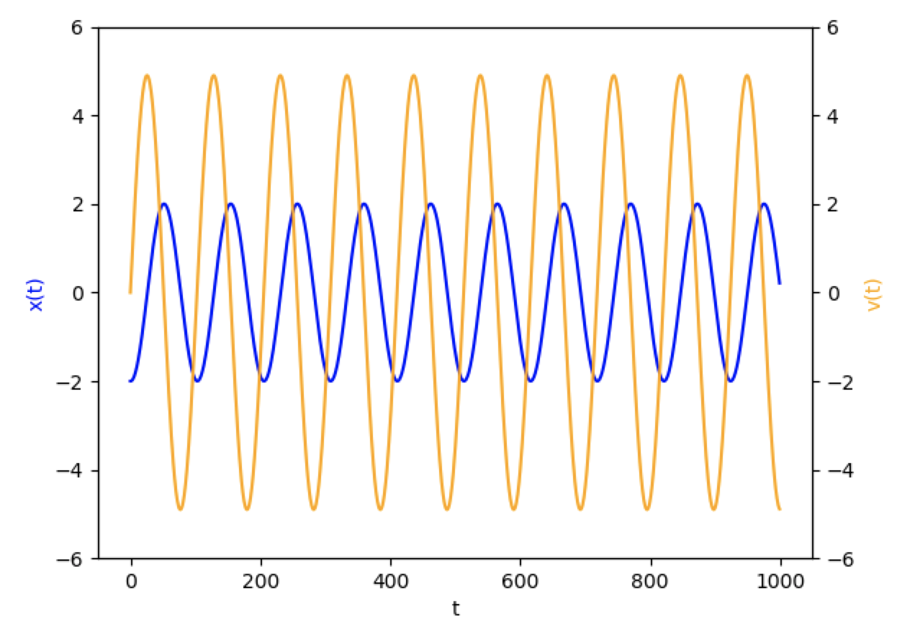
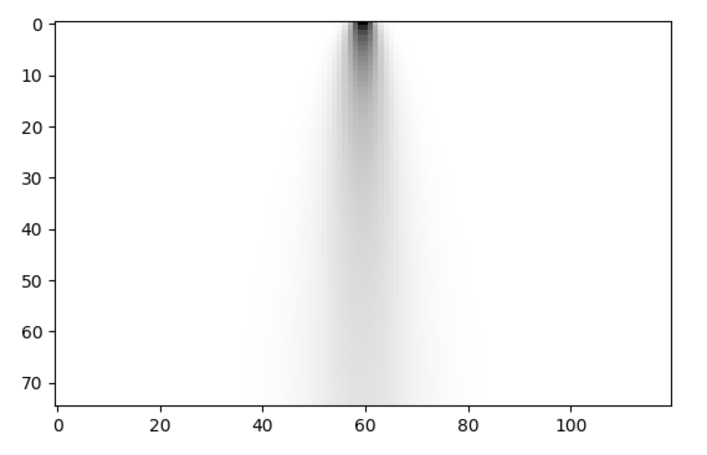

### Continuous-Time Models

Some models of computation treat time as continuous. These kinds of
models often define "equations of motion" that describe the dynamics
of the system, and often consist of one or more differential
equations. These kinds of systems can be described within the Netomaton
framework, and they can thus be thought of as Network Automata. Because
Network Automata are discrete-time systems, a continuous-time model
must first be discretized.

Consider the following automaton with a single cell that behaves like a
single spring. In this single-celled Network Automaton, the cell's state
consists of two continuous values, which represent position and
velocity. The state changes according to the following equations of
motion:
```
dx/dt = v
dv/dt = −k/m x − b/m v
```
where `x` is position, `v` is velocity, `k` is stiffness, `b` is damping,
`m` is mass, `t` is time.

This makes the cell's state change as if it had the mechanics of a
single spring. Since a Network Automaton exists in discrete time, the
state will be updated with difference equations, using the Euler method.
For `k = 3.0`, `m = 0.5`, `b = 0.0`, the equations of motion reduce to:
```
dx/dt = v
dv/dt = −6 x
```
and the difference equations are:
```
x[n+1] = x[n] + Δt*v[n]
v[n+1] = v[n] + Δt*(−6x[n])
```

The following code snippet demonstrates this automaton:
```python
import netomaton as ntm
import matplotlib.pyplot as plt

adjacencies = [[1]]

dt = 0.025000

def activity_rule(n, c, t):
    x_n, v_n = n.current_activity
    x_new = x_n + (dt * v_n)
    v_new = v_n + (dt * (-6 * x_new))
    return x_new, v_new

initial_conditions = [(-2.00000, 0.00000)]

activities, _ = ntm.evolve(initial_conditions, adjacencies, activity_rule, timesteps=1000)

# plot the position and velocity as a function of time
positions = [a[0][0] for a in activities]
velocities = [a[0][1] for a in activities]
fig, ax1 = plt.subplots()
x = [i for i in range(1000)]
ax2 = ax1.twinx()
ax1.plot(x, positions, 'blue')
ax2.plot(x, velocities, 'orange')
ax1.set_xlabel('t')
ax1.set_ylabel('x(t)', color='blue')
ax2.set_ylabel('v(t)', color='orange')
ax1.set_ylim(-6, 6)
ax2.set_ylim(-6, 6)
plt.show()
```



The full source code for this example can be found [here](single_spring_netomaton_demo.py).

A partial differential equation can also be modelled. The following
automaton models the Diffusion (or Heat) Equation:
∂u/∂t = α ∂<sup>2</sup>u/∂x<sup>2</sup>.
In this multi-cellular Network Automaton, each of the 120 cells
represents a body that can contain some amount of heat. The following
code snippet demonstrates this automaton:

```python
import numpy as np
import netomaton as ntm

space = np.linspace(25, -25, 120)
initial_conditions = [np.exp(-x ** 2) for x in space]

adjacencies = ntm.network.cellular_automaton(120)

a = 0.25
dt = .5
dx = .5
F = a * dt / dx ** 2

def activity_rule(n, c, t):
    current = n.current_activity
    left = n.activities[0]
    right = n.activities[2]
    return current + F * (right - 2 * current + left)


activities, _ = ntm.evolve(initial_conditions, adjacencies, activity_rule, timesteps=75)

ntm.plot_grid(activities)
```



Note that in the automaton above, a cell's neighbourhood influences the
state of the cell, and the system can be thought of as a 1D Cellular
Automaton with continuous state values. (The automaton above also
closely resembles the plot at the top of Wolfram's NKS, page 163.)

See the following for more information:

* https://www.myphysicslab.com/explain/numerical-solution-en.html

* http://hplgit.github.io/num-methods-for-PDEs/doc/pub/diffu/sphinx/._main_diffu001.html

* https://www.wolframscience.com/nks/p163--partial-differential-equations/
