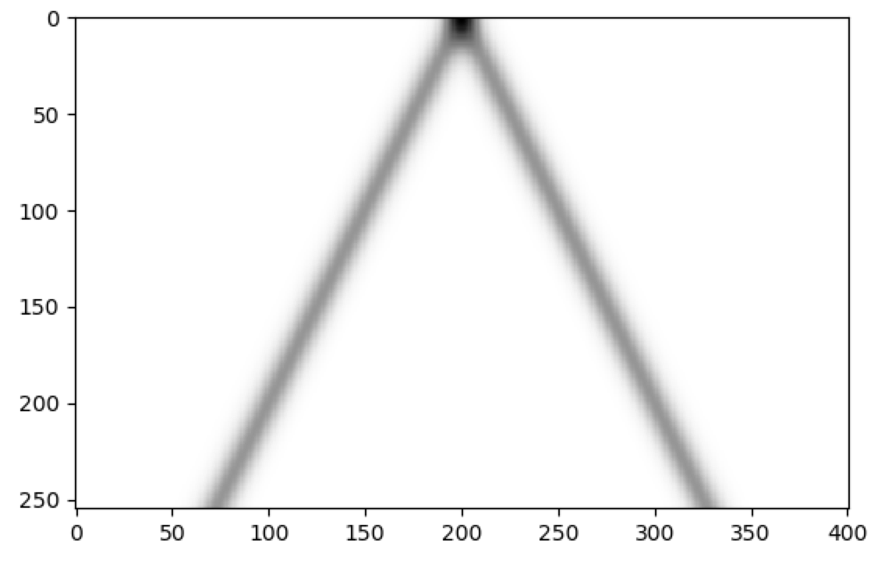

# Continuous-Time Models

Some models of computation treat time as continuous. These kinds of
models often define "equations of motion" that describe the dynamics
of the system, and often consist of one or more differential
equations. These kinds of systems can be described within the Netomaton
framework, and they can thus be thought of as Network Automata. Because
Network Automata are discrete-time systems, a continuous-time model
must first be discretized.

Consider the following automaton with a single node that behaves like a
single spring. In this single-node Network Automaton, the node's state
consists of two continuous values, which represent position and
velocity. The state changes according to the following equations of
motion:
```
dx/dt = v
dv/dt = −k/m x − b/m v
```
where `x` is position, `v` is velocity, `k` is stiffness, `b` is damping,
`m` is mass, `t` is time.

This makes the node's state change as if it had the mechanics of a
single spring. Since a Network Automaton exists in discrete time, the
state will be updated with difference equations, using the Euler method.
For `k = 3.0`, `m = 0.5`, `b = 0.0`, the equations of motion reduce to:
```
dx/dt = v
dv/dt = −6 x
```
and the difference equations are:
```
x[n+1] = x[n] + Δt*v[n]
v[n+1] = v[n] + Δt*(−6x[n])
```

The following code snippet demonstrates this automaton:
```python
import netomaton as ntm
import matplotlib.pyplot as plt

adjacency_matrix = [[1]]

dt = 0.025000

def activity_rule(ctx):
    x_n, v_n = ctx.current_activity
    x_new = x_n + (dt * v_n)
    v_new = v_n + (dt * (-6 * x_new))
    return x_new, v_new

initial_conditions = [(-2.00000, 0.00000)]

activities, _ = ntm.evolve(initial_conditions, adjacency_matrix, activity_rule, timesteps=1000)

# plot the position and velocity as a function of time; see the source code file for details
```


The full source code for this example can be found [here](single_spring_netomaton_demo.py).

A partial differential equation can also be modelled. The following
automaton models the Diffusion (or Heat) Equation: ∂u/∂t = α ∂²u/∂x².
In this Network Automaton, each of the 120 nodes represents a body that
can contain some amount of heat. The following code snippet demonstrates
this automaton:

```python
import numpy as np
import netomaton as ntm

space = np.linspace(25, -25, 120)
initial_conditions = [np.exp(-x ** 2) for x in space]

adjacency_matrix = ntm.topology.adjacency.cellular_automaton(120)

a = 0.25
dt = .5
dx = .5
F = a * dt / dx ** 2

def activity_rule(ctx):
    current = ctx.current_activity
    left = ctx.activities[0]
    right = ctx.activities[2]
    return current + F * (right - 2 * current + left)


activities, _ = ntm.evolve(initial_conditions, adjacency_matrix, activity_rule, timesteps=75)

ntm.plot_grid(activities)
```


The full source code for this example can be found [here](simple_diffusion_demo.py).

Note that in the automaton above, a node's neighbourhood influences the
state of the node, and the system can be thought of as a 1D Cellular
Automaton with continuous state values evolving in continuous time.
(The automaton above also closely resembles the plot at the top of
Wolfram's NKS, page 163.)

The examples above involve working with the first derivative of a
variable with respect to time. However, it is also possible to implement
models with higher-order derivatives of a variable with respect to time.
The following example demonstrates an implementation of the 1D Wave
Equation, ∂²u/∂t² = ∂²u/∂x²:

```python
import netomaton as ntm
import numpy as np

nx = 401  # the number of nodes (i.e. the number of points in the grid)
nt = 255  # the number of timesteps
dx = 0.1  # the distance between any pair of adjacent points
dt = .05  # the amount of time each timestep covers

space = np.linspace(20, -20, nx)
initial_conditions = [np.exp(-x ** 2) for x in space]

adjacency_matrix = ntm.topology.adjacency.cellular_automaton(nx)

def activity_rule(ctx):
    un_i = ctx.current_activity
    un_i_m1 = ctx.activity_of((ctx.node_index - 1) % nx)
    un_i_p1 = ctx.activity_of((ctx.node_index + 1) % nx)
    # the activity not at the previous timestep, but the timestep before that
    un_m1_i = ctx.past_activity_of(ctx.node_index)
    return ((dt**2 * (un_i_p1 - 2*un_i + un_i_m1)) / dx**2) + (2*un_i - un_m1_i)

activities, _ = ntm.evolve(initial_conditions, adjacency_matrix, activity_rule, timesteps=nt,
                           past_conditions=[initial_conditions])

ntm.plot_grid(activities)
```



The full source code for this example can be found [here](wave_equation_demo.py).

Note the use of the `past_conditions` parameter of the `evolve`
function. Setting the past conditions makes part of the history of the
evolution available in the `NodeContext`. (The automaton above also
closely resembles the plot in the middle of Wolfram's NKS, page 163.)

The [Gray-Scott Reaction-Diffusion model](../reaction_diffusion/README.md)
and the [Hopfield-Tank Neural Network](../hopfield_tank_tsp/README.md)
are also examples of continuous-time models that have been implemented
in this project as Network Automata.

Finally, a good resource for learning more about working with partial
differential equations computationally is [CFD Python](https://github.com/barbagroup/CFDPython/blob/master/README.md).
Several examples from that resource are implemented with Netomaton here:

* [1D Linear Convection](linear_convection_demo.py)
* [1D Non-linear Convection](nonlinear_convection_demo.py)
* [1D Diffusion](diffusion_demo.py)
* [Burger's Equation](burgers_equation_demo.py)

See the following for more information:

* https://www.myphysicslab.com/explain/numerical-solution-en.html

* http://hplgit.github.io/num-methods-for-PDEs/doc/pub/diffu/sphinx/._main_diffu001.html

* https://www.wolframscience.com/nks/p163--partial-differential-equations/
