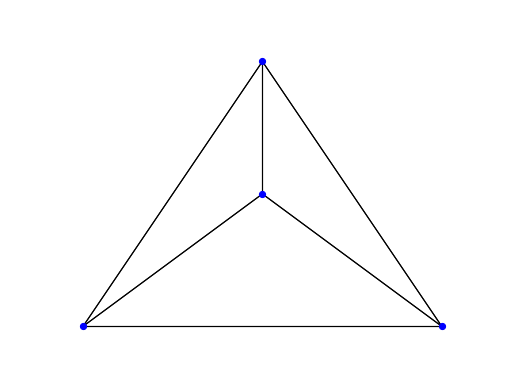

# Evolving Networks

A reproduction (albeit with a different layout) of the network automaton described at the top of page 509 of 
_A New Kind of Science_. The network automaton consists solely of a topology rule that simply inserts new nodes into the
existing network.

```python
import netomaton as ntm

network = ntm.Network()
network.add_edge_bidir("1", "2")
network.add_edge_bidir("1", "3")
network.add_edge_bidir("2", "3")
network.add_edge_bidir("1", "4")
network.add_edge_bidir("2", "4")
network.add_edge_bidir("3", "4")

def topology_rule(ctx):
    new_network = ctx.network.copy()

    for node in ctx.network.nodes:
        new_node_a = node + "a"
        new_node_b = node + "b"
        new_node_c = node + "c"

        new_network.add_edge_bidir(new_node_a, new_node_b)
        new_network.add_edge_bidir(new_node_a, new_node_c)
        new_network.add_edge_bidir(new_node_b, new_node_c)

        inserted = [new_node_a, new_node_b, new_node_c]
        for incoming_node in new_network.in_edges(node):
            to_connect = inserted.pop()
            new_network.add_edge_bidir(to_connect, incoming_node)

        new_network.remove_node(node)

    return new_network

trajectory = ntm.evolve(network, topology_rule=topology_rule, timesteps=4)

ntm.animate_network(trajectory, with_labels=False, with_arrows=False,
                    layout=["planar"] + ["kamada-kawai"]*3, interval=500)
```



The full source code for this example can be found [here](evolving_networks_demo.py).