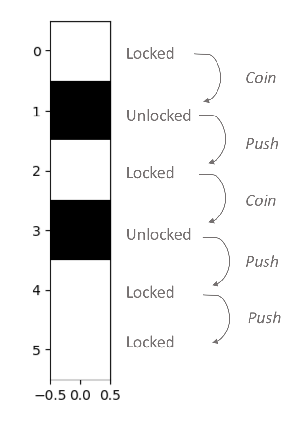

### Finite State Machine

This example illustrates the construction of a Finite State Machine.
Although simplistic, it demonstrates the generality of the Network
Automaton model. A Finite State Machine can be thought of as a Network
Automaton with a single cell.

The "Turnstile" FSM in this case contains two states: Locked (0) and Unlocked (1).
It can undergo two kinds of transitions: Push ("p") and Coin ("c").
The machine starts off in the Locked state.
If a push is given in the Locked state, it remains Locked.
If a coin is given in the Locked state, it transitions to Unlocked.
If a push is given in the Unlocked state, it transitions to Locked.
If a coin is given in the Unlocked state, it remains Unlocked.

In the example below, the machine is subjected to a sequence of five
events: Coin, Push, Coin, Push, Push.

```python
import netomaton as ntm

states = {'locked': 0, 'unlocked': 1}
transitions = {'PUSH': 'p', 'COIN': 'c'}

# a FSM can be thought of as a Network Automaton with a single cell
adjacencies = [[1]]

# the FSM starts off in the Locked state
initial_conditions = [states['locked']]

events = "cpcpp"

def fsm_rule(n, c, event):
    if event == transitions['PUSH']:
        return states['locked']
    else:
        # COIN event
        return states['unlocked']

activities, _ = ntm.evolve(initial_conditions, adjacencies, input=events,
                           activity_rule=fsm_rule)

ntm.plot_grid(activities)
```



The full source code for this example can be found [here](finite_state_machine_demo.py).