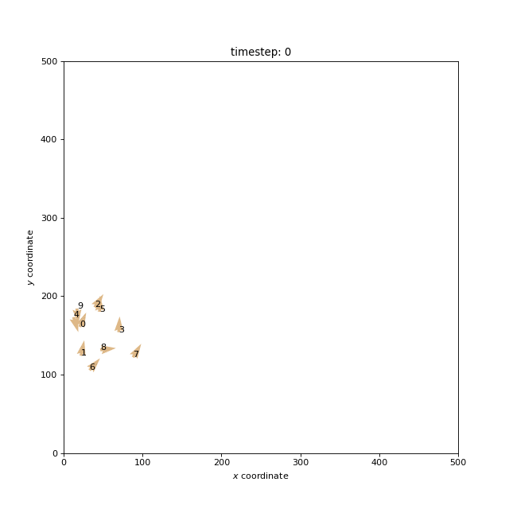

# Flocking

Flocking behaviour seen in nature can be captured by the Boids algorithm, an artificial life construct developed by 
Craig Reynolds in 1986. Here, we demonstrate that the phenomenon of flocking can be regarded as emergent behaviour in a 
complex system which can be described by a network automaton: Each individual (or Boid) is connected to other 
individuals present in their visual range. This network influences the movement and location of each individual, which
in turn influences the network, and so on.

To construct the network automaton, we define both an `activity_rule` and a `topology_rule`. The `topology_rule` simply
determines the distance between each individual, and connects them if they are within visual range. The `activity_rule`
is applied to each individual during a timestep: it obtains the state of each neighbour (i.e. their position and 
velocity) in the visual range, and updates the individual's position and velocity accordingly.

Below are plots resulting from a simulation with 10 Boids:

The top plot illustrates how the individuals' states (positions and velocities) are changing with time. The bottom plot
depicts the corresponding network as it changes with time.

The full source code for this example can be found [here](flocking_demo.py).

For more information, please refer to the following resources:

https://en.wikipedia.org/wiki/Boids

https://people.ece.cornell.edu/land/courses/ece4760/labs/s2021/Boids/Boids.html

http://rits.github-pages.ucl.ac.uk/doctoral-programming-intro/02-novice/100Boids.html

> Reynolds, C. W. (1987, August). Flocks, herds and schools: A distributed behavioral model. In Proceedings of the 14th 
annual conference on Computer graphics and interactive techniques (pp. 25-34).
