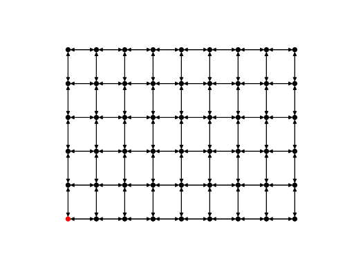

# Functional Network Automata

An example of a network automaton that contains both an activity rule and a topology rule. The topology rule simply 
removes the edge between two nodes if they are both activated (i.e. have an activity of "1" as opposed to "0"). The 
purpose of this demo is to illustrate the creation of topology rules that depend on changing node activities.

```python
import netomaton as ntm

n_x, n_y = 9, 6
network = ntm.topology.lattice(dim=(1, n_y, n_x), periodic=False)

initial_conditions = {node: 0 for node in network.nodes}
initial_conditions[0] = 1

def activity_rule(ctx):
    if sum(ctx.neighbourhood_activities) > 0:
        return 1
    return ctx.current_activity

def topology_rule(ctx):
    new_network = ctx.network.copy()

    for i, j, _ in ctx.network.edges:
        i_activity = ctx.activities[i]
        j_activity = ctx.activities[j]

        if i_activity == 1 and j_activity == 1:
            new_network.remove_edge(i, j)

    return new_network

trajectory = ntm.evolve(network=network, initial_conditions=initial_conditions,
                        topology_rule=topology_rule, activity_rule=activity_rule,
                        timesteps=14, update_order=ntm.UpdateOrder.ACTIVITIES_FIRST)

pos = ntm.vis.lattice_pos(n_x, n_y)
colors = {i: ["red" if state.activities[node] == 1 else "black" for node in state.network.nodes]
          for i, state in enumerate(trajectory)}
ntm.animate_network(trajectory, layout=pos, interval=500, with_labels=False, node_color=colors)
```



The full source code for this example can be found [here](functional_network_automata_demo.py).
