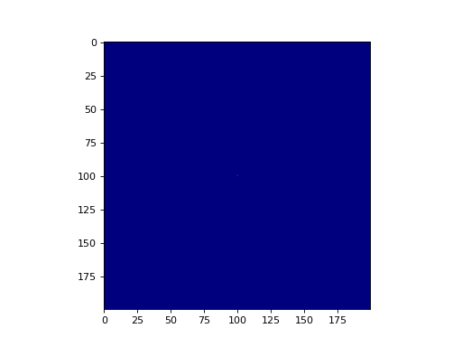

Biologically Inspired Model
===========================

In 2011, David M. D. Smith and colleagues described Network Automata, a computational framework in which the topological 
evolution of a network is coupled to its structure. To demonstrate Network Automata, they implemented a biologically 
inspired model of fungal growth. 

The model consists of a number of agents related spatially via an underlying lattice. The agents accumulate resources 
through absorption from a resource layer, and the resources are moved between neighbours. Netomaton contains an 
implementation of the fungal growth model described by Smith et al., in the `FungalGrowthModel` class. The following is 
an example of how the `FungalGrowthModel` class can be used to model fungal growth:

```python
import netomaton as ntm

R_E = 80000.0  # resource absorption rate
timesteps = 100
width = 200
height = 200
# for longer timeframes (e.g. 1000 timesteps) and more nodes, set this to True;
#  it will take a little longer, but the memory footprint will be greatly reduced
compression = False
# if the network over time is not of interest, then set this to False,
# and the network will not be persisted, reducing both the memory and running time footprint
persist_network = False

initial_conditions = ntm.init_simple2d(width, height, val=R_E, dtype=float)

model = ntm.FungalGrowthModel(R_E, width, height, initial_conditions, seed=20210408)

trajectory = ntm.evolve(network=model.network, initial_conditions=initial_conditions, timesteps=timesteps,
                        activity_rule=model.activity_rule, topology_rule=model.topology_rule,
                        update_order=model.update_order, copy_network=model.copy_network,
                        compression=compression, persist_network=persist_network)

ntm.animate_activities(trajectory, shape=(width, height), interval=200, colormap="jet")
```



The full source code for this example can be found [here](fungal_growth_demo.py).

For more information, see:

> Smith, David MD, et al. "Network automata: Coupling structure and function in dynamic networks." Advances in Complex Systems 14.03 (2011): 317-339.
