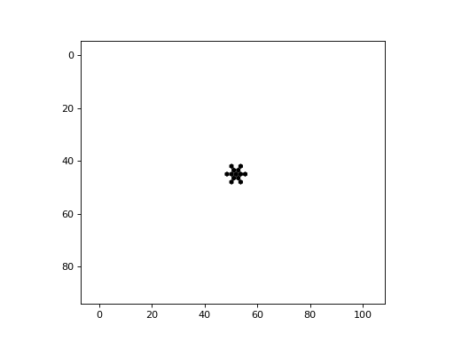

# Hexagonal Cell Lattices

Netomaton supports automata with hexagonal node lattices. A hexagonal
node with a neighbourhood of radius 1 is depicted below:


The example below demonstrates the "snowflake" Cellular Automaton,
described on [page 371](https://www.wolframscience.com/nks/p371--the-growth-of-crystals/)
of Wolfram's *A New Kind of Science*:

```python
import netomaton as ntm

network = ntm.topology.cellular_automaton2d(60, 60, r=1, neighbourhood="Hex")

initial_conditions = ntm.init_simple2d(60, 60)

def activity_rule(ctx):
    return 1 if sum(ctx.neighbourhood_activities) == 1 else ctx.current_activity

trajectory = ntm.evolve(initial_conditions=initial_conditions, network=network, timesteps=31,
                        activity_rule=activity_rule)

ntm.animate_hex(trajectory, shape=(60, 60), interval=150)
```



The full source code for this example can be found [here](hexagonal_ca_demo.py).
