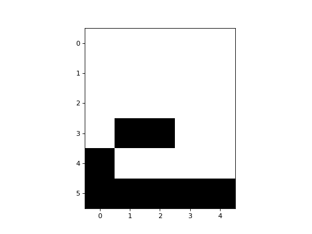

# Hopfield Network

The Hopfield Network can be thought of as a network automaton with a
complete graph. The nodes (or neurons) are binary units, and
the activity rule is a simple threshold rule, where the weighted inputs
to a node are summed and compared to a threshold value. The weights are
defined in the adjacency matrix.

Netomaton already comes with a Hopfield Net implementation. To use it,
we must first train the network, by giving it a set of patterns:

```python
from netomaton import *

zero = [
    0, 1, 1, 1, 0,
    1, 0, 0, 0, 1,
    1, 0, 0, 0, 1,
    1, 0, 0, 0, 1,
    1, 0, 0, 0, 1,
    0, 1, 1, 1, 0]
one = [
    0, 1, 1, 0, 0,
    0, 0, 1, 0, 0,
    0, 0, 1, 0, 0,
    0, 0, 1, 0, 0,
    0, 0, 1, 0, 0,
    0, 0, 1, 0, 0]
two = [
    1, 1, 1, 0, 0,
    0, 0, 0, 1, 0,
    0, 0, 0, 1, 0,
    0, 1, 1, 0, 0,
    1, 0, 0, 0, 0,
    1, 1, 1, 1, 1]
# replace the zeroes with -1 to make these vectors bipolar instead of binary
one = [-1 if x == 0 else x for x in one]
two = [-1 if x == 0 else x for x in two]
zero = [-1 if x == 0 else x for x in zero]

hopfield_net = HopfieldNet(n=30)

hopfield_net.train([zero, one, two])
```

As is seen above, we must instantiate an instance of a `HopfieldNet`,
specifying the number of nodes in the network. Then, we must call
`train`, providing a list of training examples.

Using the Hopfield Net involves providing a potentially incomplete
pattern, and evolving the network for a pre-specified number of timesteps.
The network state should settle into a pattern that resembles those seen
during training. It acts like a content-addressable (associative) memory.

```python
half_two = [
        0, 0, 0, 0, 0,
        0, 0, 0, 0, 0,
        0, 0, 0, 0, 0,
        0, 1, 1, 0, 0,
        1, 0, 0, 0, 0,
        1, 1, 1, 1, 1]
half_two = [-1 if x == 0 else x for x in half_two]

initial_conditions = half_two

trajectory = evolve(initial_conditions=initial_conditions, 
                    network=hopfield_net.network,
                    timesteps=hopfield_net.num_nodes * 7, 
                    activity_rule=hopfield_net.activity_rule)

# view the time evolution of the Hopfield net as it completes the given pattern
activities = get_activities_over_time_as_list(trajectory)
animate_activities(activities[::hopfield_net.num_nodes], shape=(6, 5), interval=150)
```



The full source code for this example can be found [here](hopfield_net_demo.py).

See the following resources for some more information on Hopfield nets:

* https://en.wikipedia.org/wiki/Hopfield_network

* http://neupy.com/2015/09/20/discrete_hopfield_network.html

> J. J. Hopfield, "Neural networks and physical systems with emergent collective computational abilities", Proceedings of the National Academy of Sciences of the USA, vol. 79 no. 8 pp. 2554–2558, April 1982.
