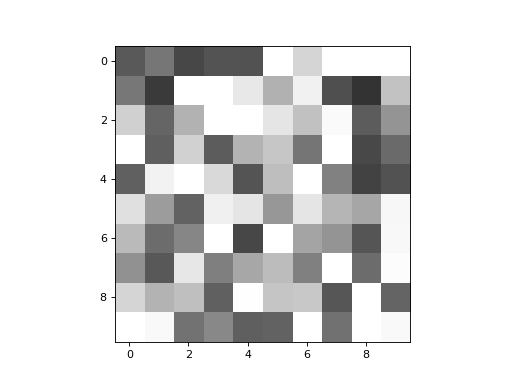
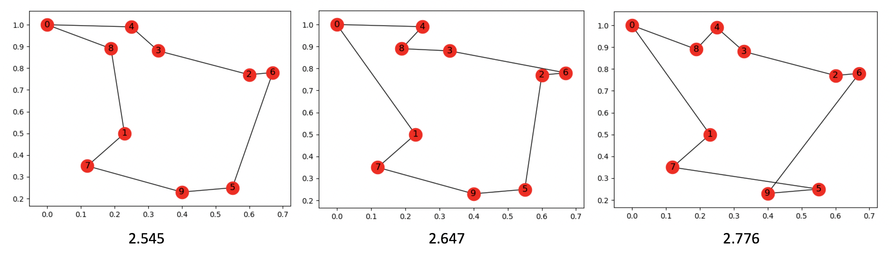

### Travelling Salesman Problem with the Hopfield-Tank Neural Net

The Hopfield-Tank Neural Network is a model of a network of densely
connected non-linear analog neurons. The model provides solutions to the
Travelling Salesman optimization problem. The Hopfield-Tank Neural
Network can be thought of as a continuous-time Network Automaton with a
fully connected network.

Netomaton comes with a built-in implementation of the Hopfield-Tank
Neural Network. An example is given below:

```python
points = [(0, 1), (0.23, 0.5), (0.6, 0.77), (0.33, 0.88), (0.25, 0.99),
          (0.55, 0.25), (0.67, 0.78), (0.12, 0.35), (0.19, 0.89), (0.40, 0.23)]

# this hyperparameter combination provides an avg. tour length of
#  2.9605078829924527, with a 70% convergence rate
A, B, C, D, n, dt, timesteps = 300, 300, 100, 300, 12, 1e-05, 1000

tsp_net = ntm.HopfieldTankTSPNet(points, dt=dt, A=A, B=B, C=C, D=D, n=n)

adjacency_matrix = tsp_net.adjacency_matrix

# -0.022 was chosen so that the sum of V for all nodes is 10;
# some noise is added to break the symmetry
initial_conditions = [-0.022 + np.random.uniform(-0.1*0.02, 0.1*0.02) for _ in range(len(adjacency_matrix))]

activities, _ = ntm.evolve(initial_conditions, adjacency_matrix, tsp_net.activity_rule, timesteps=timesteps, parallel=True)

ntm.animate(activities, shape=(10, 10))

permutation_matrix = tsp_net.get_permutation_matrix(activities)

G, pos, length = tsp_net.get_tour_graph(points, permutation_matrix)

tsp_net.plot_tour(G, pos)
```

The Hopfield-Tank Neural Network is quite sensitive to initial
conditions. There are a number of hyperparameters, and various
combinations of values generally result in a tradeoff between
convergence rate and performance. That is, some settings result in a
better convergence rate<sup>*</sup> but less-than-ideal solutions,
whereas other settings result in very good solutions, but lower
convergence rates.

The combination of hyperparameters in the example above results in a
convergence rate of ~70% and an average tour length of ~2.961.

As the network evolves, it is computing the values of what Hopfiled and
Tank call the _permutation matrix_. The final state of the permutation
matrix encodes the tour discovered by the network. An example of its
evolution is depicted below:



Some of the solutions discovered by this network are shown below:



To learn more about the Hopfield-Tank Neural Network, please see:

> J. J. Hopfield and D. W. Tank, "'Neural' Computation of Decisions in Optimization Problems", Biol. Cybern: 52, 141-152 (1985).

> Hopfield, John J., and David W. Tank. "Computing with neural circuits: A model." Science 233.4764 (1986): 625-633.


<sup>*</sup> Convergence here means finding a valid solution.