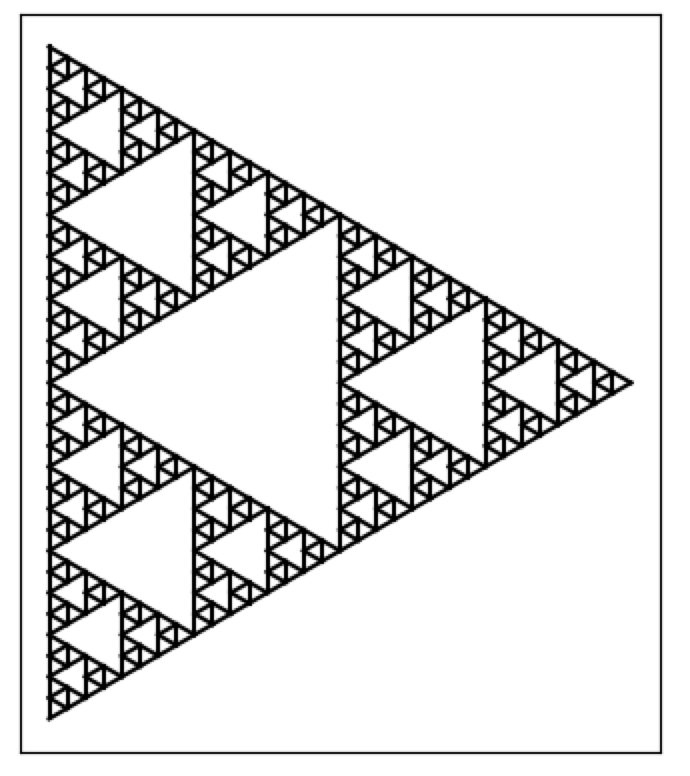
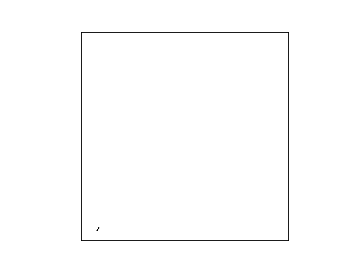

# Lindenmayer Systems

Lindenmayer Systems, or L-Systems, can be thought of as a kind of substitution system, which consist an alphabet of 
symbols that are used to make a string, and a set of rules for specifying substitutions of symbols comprising the 
string. They are dynamical systems, with a specified starting state, and a discrete time evolution. It is possible to 
implement L-Systems with Netomaton by using the `SubstitutionSystem` class.

An evolved L-System string has a particular geometric interpretation that is realized by translating the string into 
a graphical representation. Typically, this is achieved using turtle graphics. Netomaton contains a lightweight turtle
graphics implementation, in the `Turtle` class, used in conjunction with the `plot_L_system` and `animate_L_system` 
functions.

The following demonstrates the creation of a Sierpinski triangle:

```python
import netomaton as ntm

system = ntm.SubstitutionSystem(rules={
    "F": "F-G+F+G-F",
    "G": "GG"
}, constants=["+", "-"], axiom="F-G-G")

trajectory = ntm.evolve(network=system.network,
                        initial_conditions=system.initial_conditions,
                        activity_rule=system.activity_rule, timesteps=6)

t = ntm.Turtle()
ntm.plot_L_system(state=trajectory[-1], turtle=t, bindings={
    "F": t.forward,
    "G": t.forward,
    "+": (t.rotate, -120),
    "-": (t.rotate, 120)
})
```



The full source code for this example can be found [here](sierpinski_triangle_demo.py). See also the examples for 
creating a [Moore curve](moore_curve_demo.py), a [Koch curve](koch_curve_demo.py), and a 
[fractal tree](fractal_tree_demo.py).

The rendering of an L-system implemented with Netomaton can also be animated, as is demonstrated in the following 
example of a fractal plant:

```python
import netomaton as ntm

system = ntm.SubstitutionSystem(rules={
    "X": "F+[[X]-X]-F[-FX]+X",
    "F": "FF"
}, constants=["+", "-", "[", "]"], axiom="X")

trajectory = ntm.evolve(network=system.network,
                        initial_conditions=system.initial_conditions,
                        activity_rule=system.activity_rule, timesteps=6)

t = ntm.Turtle(start_orientation=25)
ntm.animate_L_system(state=trajectory[-1], turtle=t, bindings={
    "F": t.forward,
    "X": [],
    "+": (t.rotate, -25),
    "-": (t.rotate, 25),
    "[": t.push,
    "]": t.pop,
}, repeat=True, interval=1)
```



The full source code for this example can be found [here](fractal_plant_demo.py).

For more information, see:

> https://en.wikipedia.org/wiki/L-system

> https://en.wikipedia.org/wiki/Turtle_graphics

> https://www.wolframscience.com/nks/p400--growth-of-plants-and-animals/
