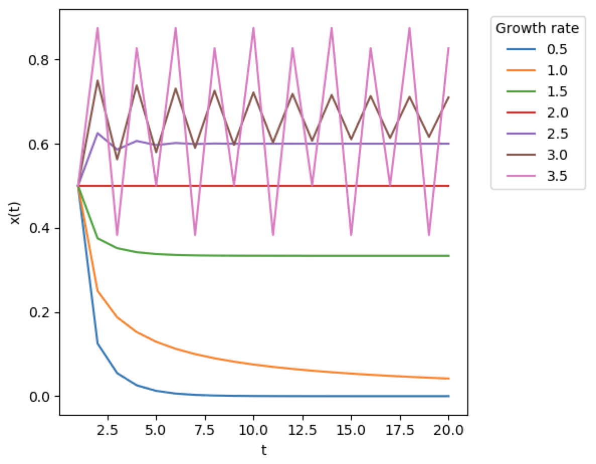
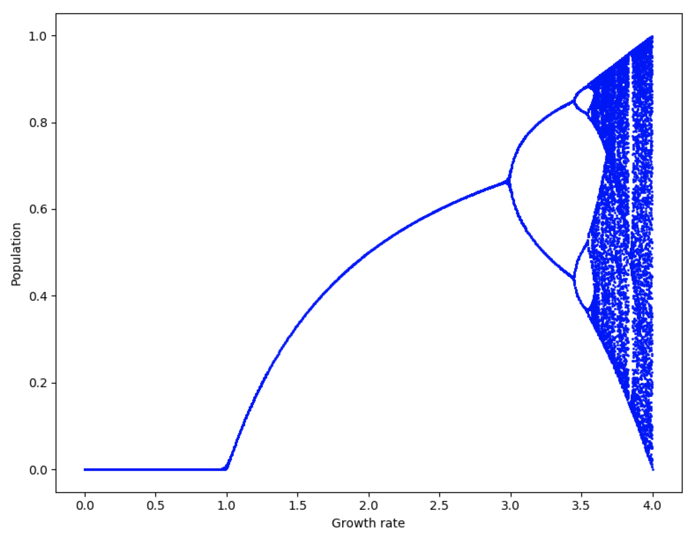
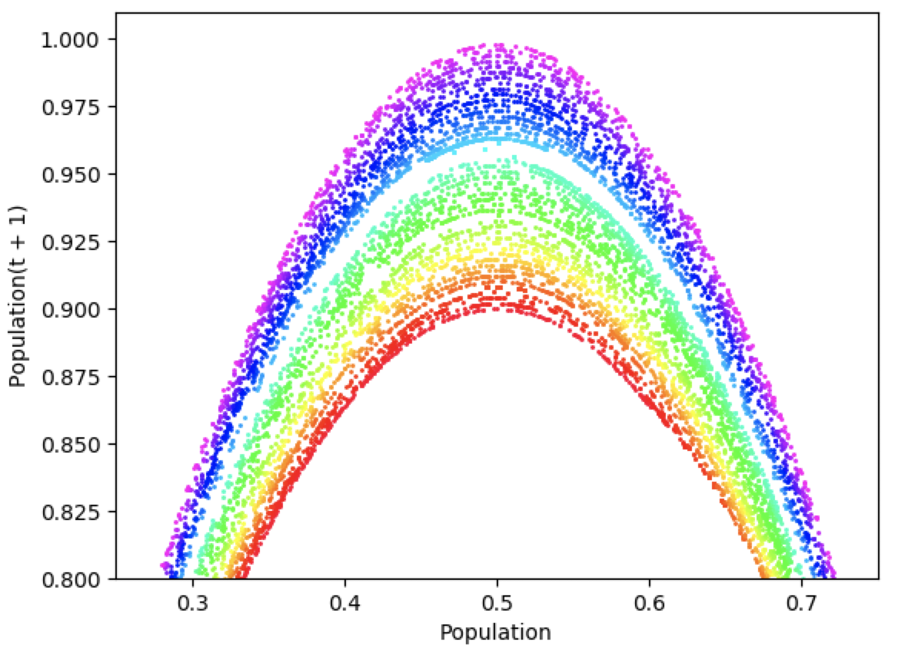

# Logistic Map

The Logistic Map is an iterated function that is described by a non-linear difference equation:

<i>x<sub>t+1</sub> = rx<sub>t</sub>(1 - x<sub>t</sub>)</i>

In the difference equation above, <i>x</i> represents the population size at a point in time, <i>t</i>, and <i>r</i> 
represents the growth rate.

The Logistic Map is often studied in the context of Chaos Theory, and indeed, it is an archetype for a chaotic system. 
It is also an example of a system that exhibits complex behaviour despite consisting of simple rules.

The Logistic Map can be placed into the Network Automaton framework by considering a network with a single node, with a
single self-connection. The node's state represents the population size, <i>x</i> (typically, a number between 0 and 1, 
which represents the fraction of maximum population size attainable). The self-connection possesses a value, which is 
the growth rate, <i>r</r>. Finally, the rule operating on the network is simply the difference equation given above.

In the following demo, we simulate a Logistic Map with Netomaton. To illustrate how the population changes in response 
to different growth rates, we set up a network with a number of disconnected nodes, so that we can evolve the system
with different growth rates in simultaneously.

```python
import netomaton as ntm
import numpy as np

timesteps = 20
growth_rates = [0.5, 1.0, 1.5, 2.0, 2.5, 3.0, 3.5]

network = ntm.topology.disconnected(len(growth_rates))
[network.add_edge(i, i, growth_rate=growth_rate) for i, growth_rate in enumerate(growth_rates)]

# all nodes have the same population value of 0.5 at the start
initial_conditions = [0.5]*len(growth_rates)

def activity_rule(ctx):
    return ctx.edge_data(ctx.node_label, "growth_rate") * ctx.current_activity * (1 - ctx.current_activity)

trajectory = ntm.evolve(initial_conditions=initial_conditions, network=network,
                        activity_rule=activity_rule, timesteps=timesteps)

activities = ntm.get_activities_over_time_as_list(trajectory)

# plot the trajectories for each growth rate
activities = np.array(activities)
ntm.plot1D(x=[n for n in range(1, timesteps + 1)],
           y=[activities[:, i] for i in range(len(growth_rates))],
           label=growth_rates, xlabel="t", ylabel="x(t)",
           legend={"title": "Growth rate", "bbox_to_anchor": (1.04, 1)},
           tight_layout={"rect": [0, 0, 0.95, 1]})
```



The source code for the example above can be found [here](logistic_map_demo.py).

Netomaton supports plotting bifurcation plots, which are useful for understanding the Logistic Map.

```python
import netomaton as ntm
import numpy as np

timesteps = 200
num_nodes = 1000
growth_rates = np.linspace(0.0, 4.0, num_nodes)

network = ntm.topology.disconnected(num_nodes)
[network.add_edge(i, i, growth_rate=growth_rate) for i, growth_rate in enumerate(growth_rates)]

initial_conditions = [0.5]*num_nodes

def activity_rule(ctx):
    return ctx.edge_data(ctx.node_label, "growth_rate") * ctx.current_activity * (1 - ctx.current_activity)

trajectory = ntm.evolve(initial_conditions=initial_conditions, network=network,
                        activity_rule=activity_rule, timesteps=timesteps)

activities = ntm.get_activities_over_time_as_list(trajectory)

# create the bifurcation plot
activities = np.array(activities)
ntm.bifurcation_plot(x=growth_rates, timesteps=int((timesteps/2)),
                     trajectories=[activities[:, i] for i in range(num_nodes)],
                     xlabel="Growth rate", ylabel="Population")
```



The source code for the example above can be found [here](logistic_map_demo2.py).

Finally, Netomaton also supports the creation of a Poincaré plot for the Logistic Map:

```python
import netomaton as ntm
import numpy as np

timesteps = 1000
num_nodes = 50
growth_rates = np.linspace(3.6, 4.0, num_nodes)

network = ntm.topology.disconnected(num_nodes)
[network.add_edge(i, i, growth_rate=growth_rate) for i, growth_rate in enumerate(growth_rates)]

initial_conditions = [0.5]*num_nodes

def activity_rule(ctx):
    return ctx.edge_data(ctx.node_label, "growth_rate") * ctx.current_activity * (1 - ctx.current_activity)

trajectory = ntm.evolve(initial_conditions=initial_conditions, network=network,
                        activity_rule=activity_rule, timesteps=timesteps)

activities = ntm.get_activities_over_time_as_list(trajectory)

# create the Poincaré plot
activities = np.array(activities)
ntm.poincare_plot(activities=[activities[:, i] for i in range(num_nodes)],
                  timesteps=int((timesteps/2)),
                  xlabel="Population", ylabel="Population(t + 1)",
                  xlim=(0.25, 0.75), ylim=(0.8, 1.01))
```



The source code for the example above can be found [here](logistic_map_demo3.py).

For more information, see:

> May, R. M. (1976). Special mathematical models with very complicated dynamics. Nature.

> https://geoffboeing.com/2015/03/chaos-theory-logistic-map/

> https://en.wikipedia.org/wiki/Logistic_map
