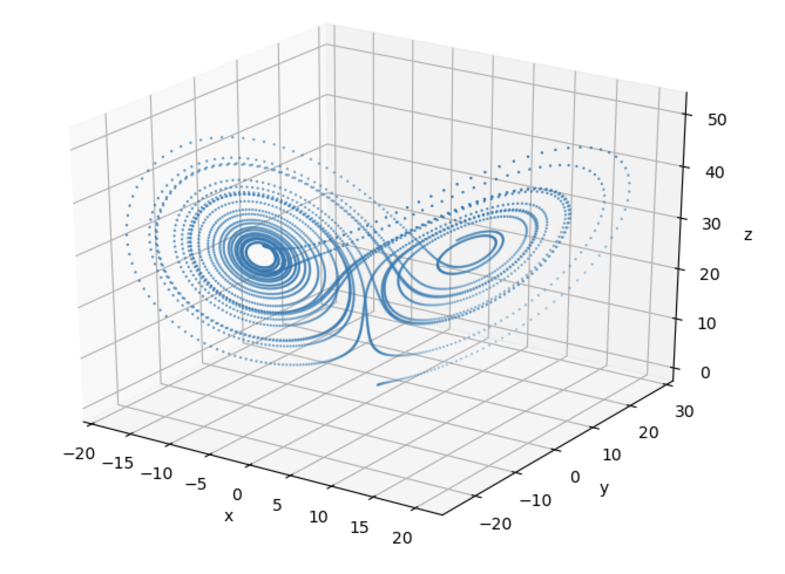

# Lorenz Attractor

The Lorenz attractor is a dynamical system consisting of 3 inter-dependent variables that evolve in continuous time.
It is perhaps best known for its chaotic properties. Here, we place the Lorenz attractor into the context of network 
automata by considering it to be a network with a single node, with a state that consists of 3 variables, `x`, `y`, and
`z`. We discretize the system, and at each timestep each of the variables are updated using their values from the 
previous timestep. The full code example is given below:

```python
import netomaton as ntm
from mpl_toolkits.mplot3d import axes3d
import matplotlib.pyplot as plt
import numpy as np

a = 10.0
b = 8/3
r = 28.0
dt = 0.005

network = ntm.Network(1)

initial_conditions = {0: [1., 1., 1.]}

def activity_rule(ctx):
    x, y, z = ctx.current_activity
    x_n = x + a*(y - x) * dt
    y_n = y + (r*x - y - x*z) * dt
    z_n = z + (x*y - b*z) * dt
    return x_n, y_n, z_n

trajectory = ntm.evolve(network, initial_conditions=initial_conditions,
                        activity_rule=activity_rule, timesteps=4500)

points = np.array(ntm.get_activities_over_time_as_list(trajectory)).squeeze(1)
X, Y, Z = points[:, 0], points[:, 1], points[:, 2]

fig = plt.figure()
ax = plt.axes(projection="3d")
ax.set_xlabel("x")
ax.set_ylabel("y")
ax.set_zlabel("z")

ax.scatter(X, Y, Z, s=0.5)

plt.show()
```



The full source code for this example can be found [here](lorenz_attractor_demo.py).

For more information, please refer to the following resources:

https://en.wikipedia.org/wiki/Lorenz_system
