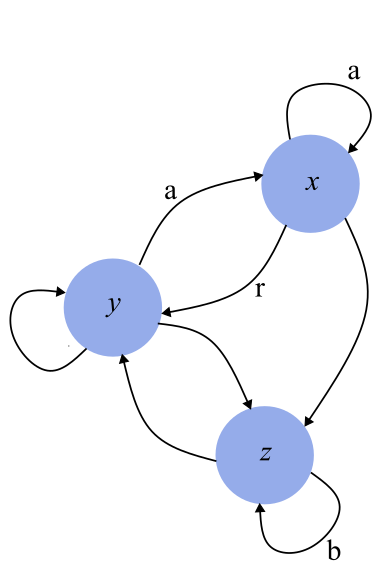

# Lorenz Attractor

The Lorenz attractor is a dynamical system consisting of 3 inter-dependent variables that evolve in continuous time.
It is perhaps best known for its chaotic properties. The variables evolve according to a system of differential 
equations:
```
dx/dt = a(y - x)
dy/dt = rx - y - xz
dz/dt = xy - bz
```
where `a`, `b` and `r` are constants.

Here, we place the Lorenz attractor into the context of network 
automata by considering it to be a network with a single node, with a state that consists of 3 variables, `x`, `y`, and
`z`. We discretize the system, and at each timestep each of the variables are updated using their values from the 
previous timestep. The full code example is given below:

```python
import netomaton as ntm
from mpl_toolkits.mplot3d import axes3d
import matplotlib.pyplot as plt
import numpy as np

a = 10.0
b = 8/3
r = 28.0
dt = 0.005

network = ntm.Network(1)

initial_conditions = {0: [1., 1., 1.]}

def activity_rule(ctx):
    x, y, z = ctx.current_activity
    x_n = x + a*(y - x) * dt
    y_n = y + (r*x - y - x*z) * dt
    z_n = z + (x*y - b*z) * dt
    return x_n, y_n, z_n

trajectory = ntm.evolve(network, initial_conditions=initial_conditions,
                        activity_rule=activity_rule, timesteps=4500)

points = np.array(ntm.get_activities_over_time_as_list(trajectory)).squeeze(1)
X, Y, Z = points[:, 0], points[:, 1], points[:, 2]

fig = plt.figure()
ax = plt.axes(projection="3d")
ax.set_xlabel("x")
ax.set_ylabel("y")
ax.set_zlabel("z")

ax.scatter(X, Y, Z, s=0.5)

plt.show()
```


The full source code for this example can be found [here](lorenz_attractor_demo.py).

An alternative view is to consider that each variable actually represents a separate node in a network:



Here, each directed edge represents a dependence on another variable. The edge weights contain the system's constants 
(an edge with no constant implies a weight of 1). The following code snippet illustrates this interpretation:

```python
a = 10
b = 8/3
r = 28
dt = 0.005

network = ntm.Network()
network.add_edge("x", "x", weight=a)
network.add_edge("y", "x", weight=a)
network.add_edge("x", "y", weight=r)
network.add_edge("z", "y", weight=1)
network.add_edge("y", "y", weight=1)
network.add_edge("x", "z", weight=1)
network.add_edge("y", "z", weight=1)
network.add_edge("z", "z", weight=b)

initial_conditions = {"x": 1., "y": 1., "z": 1.}

def activity_rule(ctx):
    node = ctx.node_label

    if node == "x":
        x, w_x = ctx.current_activity, ctx.connection_states["x"][0]["weight"]
        y, w_y = ctx.activities["y"], ctx.connection_states["y"][0]["weight"]
        activity = x + (w_y*y - w_x*x) * dt
    elif node == "y":
        y, w_y = ctx.current_activity, ctx.connection_states["y"][0]["weight"]
        x, w_x = ctx.activities["x"], ctx.connection_states["x"][0]["weight"]
        z, w_z = ctx.activities["z"], ctx.connection_states["z"][0]["weight"]
        activity = y + (w_x*x - w_y*y - x*w_z*z) * dt
    else:  # node == "z"
        z, w_z = ctx.current_activity, ctx.connection_states["z"][0]["weight"]
        x, w_x = ctx.activities["x"], ctx.connection_states["x"][0]["weight"]
        y, w_y = ctx.activities["y"], ctx.connection_states["y"][0]["weight"]
        activity = z + (w_x*x * w_y*y - w_z*z) * dt

    return activity
```

In the example above, the result is exactly the same as in the first example, except that now we have a network with 
3 nodes, with the constants acting as edge weights. The full source code for this example can be found 
[here](lorenz_attractor_demo2.py).

For more information, please refer to the following resources:

https://en.wikipedia.org/wiki/Lorenz_system
