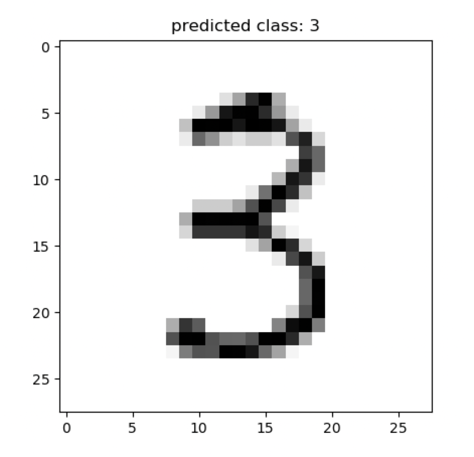

# Multilayer Perceptron

The full source code for this example can be found [here](mlp_demo.py).

_*_ _NOTE: The MLP implemented here is for demonstration purposes only, to illustrate how an MLP fits within the 
framework of network automata. In practice, one wouldn't implement an MLP this way. Other frameworks, such as Tensorflow
and PyTorch, are much better suited for building practical implementations of MLP models._

For more information, please refer to the following resources:

https://en.wikipedia.org/wiki/Multilayer_perceptron
