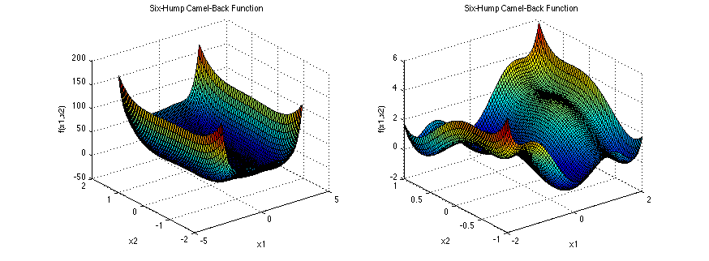

# Optimizing Particle Swarms

Particle Swarm Optimization (PSO) refers to a family of algorithms that aim to solve optimization problems using an 
approach inspired from the collective swarming and flocking behaviour often seen in nature. In this approach, a swarm of 
particles, each a potential solution to an optimization problem, is initialized randomly, and move about through the 
search space according to dynamical equations of motion. The key aspect is that a particle incorporates the best 
solution found amongst other particles in its neighbourhood during its search. In this sense, the swarm collectively 
finds an optimal solution.

Each particle can be thought to exist in a topological relationship with the other particles. Thus, a particle swarm
can be seen as a network automaton, with the goal of finding an optimal solution to a problem. At each timestep, each 
node's state (consisting of a particle's current solution, its best solution thus far, and its velocity) is updated 
according to the rules of the PSO algorithm.

We can implement an optimizing particle swarm with the Netomaton framework. Below is one such implementation:

```python
import netomaton as ntm
import numpy as np

n_particles = 10
timesteps = 30
g = None  # the best position found by the swarm
inertia_weight = 0.5
cognitive_coefficient = 1
social_coefficient = 1

network = ntm.topology.complete(n_particles)

def f(x):
    # the six-hump camel function
    x1, x2 = x
    return (4 - (2.1*x1**2) + ((x1**4)/3)) * x1**2 + x1*x2 + (-4 + (4*x2**2)) * x2**2

def activity_rule(ctx):
    global g
    x_i, p_i, v_i = ctx.current_activity

    r_p = np.random.uniform(0, 1, size=2)
    r_g = np.random.uniform(0, 1, size=2)
    scalars = np.array([inertia_weight, cognitive_coefficient, social_coefficient])
    v_i = np.array([
        v_i,
        r_p * (p_i - x_i),
        r_g * (g - x_i)
    ]).T.dot(scalars)

    x_i = x_i + v_i

    if f(x_i) < f(p_i):
        p_i = x_i

        if f(p_i) < f(g):
            g = p_i

    return x_i, p_i, v_i

def input(t, activities, net):
    print("timestep %s: best solution: %s (%s)" % (t, g, f(g)))
    if t == timesteps:
        return None  # terminate the search
    return activities

ntm.evolve(network, initial_conditions=initial_conditions,
           activity_rule=activity_rule, input=input)
```

In the example above, the objective is to find the minimum of the six-hump camel function. The global minimum for this 
function is -1.0316 at (0.0898, -0.7126) and (-0.0898, 0.7126).



*The six-hump camel function. (Source: https://www.sfu.ca/~ssurjano/camel6.html)*

The program prints out the following:
```
timestep 1: best solution: [ 1.55518457 -0.25817303] (1.4558049349741717)
timestep 2: best solution: [ 0.12346785 -0.61152265] (-0.9514686036937803)
...
timestep 28: best solution: [ 0.08987616 -0.71276822] (-1.0316283503598178)
timestep 29: best solution: [ 0.08987616 -0.71276822] (-1.0316283503598178)
timestep 30: best solution: [ 0.08987616 -0.71276822] (-1.0316283503598178)
```
It apparently can find the optimal solution for this problem. The full source code for this example can be found 
[here](pso_demo.py).

In the example above, we define a fully connected network topology. However, in the implementation, the network could 
also be fully disconnected. The idea is that the best global solution is communicated to all particles in the swarm, 
and the fully connected network symbolizes this. In the following example, we define a particle swarm as above, however,
this time we insist that each particle can access only the best solution in its neighbourhood (rather than globally):

```python
import netomaton as ntm
import numpy as np

n_particles = 20
timesteps = 500
dim = 30
inertia_weight = 0.729
cognitive_coefficient = 1
social_coefficient = 1

network = ntm.topology.watts_strogatz_graph(n=n_particles, k=4, p=0.5)

def f(x):
    # n-dimensional sphere function
    return np.sum(x**2)

def activity_rule(ctx):
    x_i, p_i, v_i = ctx.current_activity

    # determine g: the best solution in the node's neighbourhood
    g = None
    for _, p, _ in ctx.neighbourhood_activities:
        if g is None or f(p) < f(g):
            g = p

    r_p = np.random.uniform(0, 1, size=dim)
    r_g = np.random.uniform(0, 1, size=dim)
    scalars = np.array([inertia_weight, cognitive_coefficient, social_coefficient])
    v_i = np.array([
        v_i,
        r_p * (p_i - x_i),
        r_g * (g - x_i)
    ]).T.dot(scalars)

    x_i = x_i + v_i

    if f(x_i) < f(p_i):
        p_i = x_i

    return x_i, p_i, v_i


def input(t, activities, net):
    best_soln = None
    for _, p, _ in activities.values():
        if best_soln is None or f(p) < f(best_soln):
            best_soln = p

    print("timestep %s: best solution: %.3f" % (t, f(best_soln)))
    if t == timesteps:
        return None  # terminate the search
    return activities


ntm.evolve(network, initial_conditions=initial_conditions,
           activity_rule=activity_rule, input=input)
```

In the example above, the objective is to find the minimum of the 30-dimensional sphere function. It has a global 
minimum of 0 at (0, ..., 0).


*The 2-dimensional sphere function. (Source: https://www.sfu.ca/~ssurjano/spheref.html)*

The program prints the following:
```
timestep 1: best solution: 60053.682
timestep 2: best solution: 60053.682
...
timestep 498: best solution: 0.001
timestep 499: best solution: 0.001
timestep 500: best solution: 0.001
```
It apparently can find the optimal solution for this problem. The full source code for this example can be found 
[here](pso_local_demo.py).

In the examples above, the network topology is static. However, we can also imagine a system with a dynamic network
topology. Indeed, this was reported by Liu et al. in 2016, in the paper "Dynamic Small World Network Topology for 
Particle Swarm Optimization". The authors use a small-world network topology as the basis for the swarm. Over the 
course of the search, they re-configure the topology by making it less and less connected. In the example below, we 
implement their approach:

```python
import netomaton as ntm
import numpy as np
import math
...

def p_decay(timestep, initial_p=0.9, drop=0.9, timesteps_drop=10.0):
    return initial_p * math.pow(drop, math.floor((1+timestep)/timesteps_drop))

...

def topology_rule(ctx):
    new_p = p_decay(ctx.timestep)
    return ntm.topology.watts_strogatz_graph(n=n_particles, k=k, p=new_p)

ntm.evolve(network, initial_conditions=initial_conditions,
           activity_rule=activity_rule, topology_rule=topology_rule,
           update_order=ntm.UpdateOrder.ACTIVITIES_FIRST, input=input)
```

In the example above, the program is structured like the previous example, except for the changes highlighted above.
The `topology_rule` creates a new small-world network at each timestep using a decaying value of the `p` parameter.

The program prints the following:
```
timestep 1: best solution: 59863.381
timestep 2: best solution: 59863.381
...
timestep 498: best solution: 0.000
timestep 499: best solution: 0.000
timestep 500: best solution: 0.000
```
It apparently finds the optimal solution for this problem, and, in fact, it does so in less timesteps than the previous 
example (379 timesteps in this case). The full source code for this example can be found [here](pso_dynamic_demo.py).

For more information, please refer to the following resources:

https://en.wikipedia.org/wiki/Particle_swarm_optimization

> Kennedy, J., & Mendes, R. (2002, May). Population Structure and Particle Swarm Performance. In Proceedings of the 
2002 Congress on Evolutionary Computation. CEC'02 (Cat. No. 02TH8600) (Vol. 2, pp. 1671-1676). IEEE.

> Bratton, D., & Kennedy, J. (2007, April). Defining a Standard for Particle Swarm Optimization. In 2007 IEEE Swarm 
Intelligence Symposium (pp. 120-127). IEEE.

> Liu, Q., van Wyk, B. J., Du, S., & Sun, Y. (2016). Dynamic Small World Network Topology for Particle Swarm 
Optimization. International Journal of Pattern Recognition and Artificial Intelligence, 30(09), 1660009.
