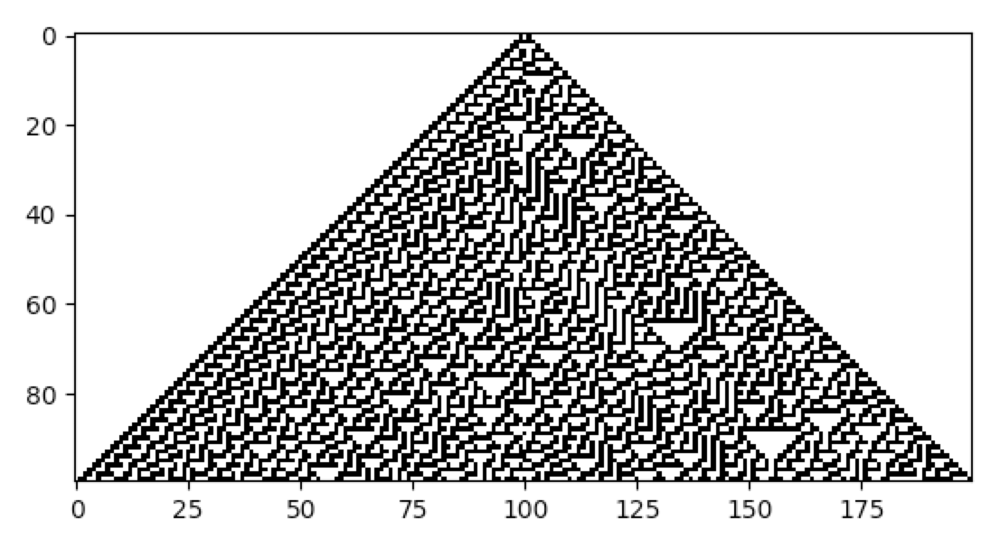
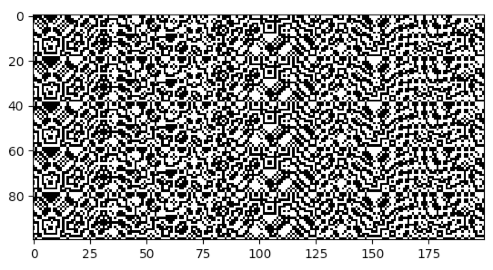

### Perturbations

Network Automata may be perturbed at any point in time during their
evolution. This may model the effects of some external forcing applied
to the system as it evolves. Many natural systems are continuously
perturbed, and not allowed to reach an equilibrium, or steady state.
Indeed, perturbations are important elements in the study of
non-equilibrium systems.

Netomaton supports perturbations. A perturbation is
simply a function that accepts a `PerturbationContext`, which contains
the cell index, its computed activity, the timestep, and any input to
the cell, and returns the new activity for that cell.

Consider the cellular automaton Rule 30 below, which is perturbed at
every timestep such that cell with index 100 is changed randomly to
either a 0 or a 1:
```python
adjacencies = ntm.network.cellular_automaton(n=200)
initial_conditions = [0] * 100 + [1] + [0] * 99

def perturb(pctx):
    """
    Mutates the value of the cell with index 100 at each timestep, making it either 0 or 1 randomly.
    """
    if pctx.cell_index == 100:
        return np.random.randint(2)
    return pctx.cell_activity

activities, _ = ntm.evolve(initial_conditions, adjacencies, timesteps=100,
                           activity_rule=lambda ctx: ntm.rules.nks_ca_rule(ctx, 30),
                           perturbation=perturb)

ntm.plot_grid(activities)
```


Another way to perturb a Network Automaton is to simply wrap the activity
rule function with yet another function. Such an approach offers more
control over when the activity is determined, and what is done with it.
Below is an example of a perturbed cellular automaton rule 90R:
```python
adjacencies = ntm.network.cellular_automaton(n=200)
initial_conditions = np.random.randint(0, 2, 200)

def perturbed_rule(ctx):
    a = ntm.rules.nks_ca_rule(ctx, 90)
    if t % 10 == 0:
        return 1
    return a

r = ntm.ReversibleRule(perturbed_rule)

activities, _ = ntm.evolve(initial_conditions, adjacencies, timesteps=100,
                           activity_rule=r.activity_rule, past_conditions=[initial_conditions])

ntm.plot_grid(activities)
```


The full source code for these examples can be found
[here](perturbation_eca_demo.py) and [here](perturbation_reversible_demo.py).
