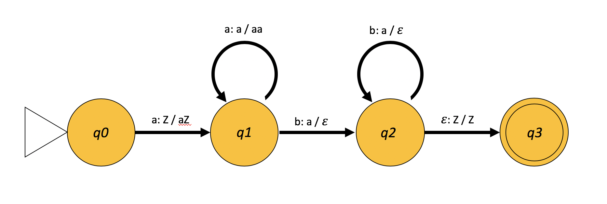

# Pushdown Automata

This example illustrates the construction of a Pushdown Automaton.
Although simplistic, it demonstrates how Pushdown Automata can be
seen as Network Automata. A Pushdown Automaton can be thought of as a
Network Automaton with a single node.

Pushdown Automata are more powerful than Finite State Machines (though
less powerful than Turing Machines). They differ from Finite State
Machines by having access to a memory, in the form of a stack.

In this example, a Pushdown Automaton (PDA) is constructed for the
language _L = {a<sup>n</sup>b<sup>n</sup> | n > 0}_. The PDA is defined
by four states: _q0_ (the initial state), _q1_, _q2_, and _q3_ (the
final/accepting state). The input alphabet consists of the symbols _a_
and _b_. The stack alphabet consists of the symbols _a_, _b_, and _Z_,
where _Z_ represents the bottom of the stack.



In the diagram above, the first character in the transition represents
the input, while the "X / Y" notation means: replace the symbol "X" on
the top of the stack with the symbol "Y". When "Y" is _ε_, this refers to
a stack pop operation. When _ε_ is an input symbol, it represents the end
of the input (or the input symbol signalling termination of the string).

```python
import netomaton as ntm

states = {
    'q0': 0,  # initial state
    'q1': 1,
    'q2': 2,
    'q3': 3   # final/accepting state
}

# a Pushdown Automaton can be thought of as a Network Automaton with a single node
network = ntm.topology.from_adjacency_matrix([[1]])

# the Pushdown Automaton starts off in the q0 state
initial_conditions = [states['q0']]

# 'Z' is the symbol representing the bottom of the stack
stack = ['Z']

# '\n' is the symbol representing the end of the input
events = "aaabbb\n"

def pda_rule(ctx):
    current_state = ctx.current_activity
    if current_state == states['q0'] and ctx.input == 'a' and stack[-1] == 'Z':
        stack.append('a')
        return states['q1']
    elif current_state == states['q1'] and ctx.input == 'a' and stack[-1] == 'a':
        stack.append('a')
        return states['q1']
    elif current_state == states['q1'] and ctx.input == 'b' and stack[-1] == 'a':
        stack.pop()
        return states['q2']
    elif current_state == states['q2'] and ctx.input == 'b' and stack[-1] == 'a':
        stack.pop()
        return states['q2']
    elif current_state == states['q2'] and ctx.input == '\n' and stack[-1] == 'Z':
        return states['q3']
    else:
        raise Exception("input rejected")

try:
    trajectory = ntm.evolve(initial_conditions=initial_conditions, network=network,
                            input=events, activity_rule=pda_rule)
    activities = ntm.get_activities_over_time_as_list(trajectory)
    print("'%s' accepted (final state: %s)" % (events.strip(), activities[-1][0]))
except Exception:
    print("'%s' rejected!" % events.strip())
```

The program above will print `'aaabbb' accepted (final state: 3)`. If
the `event` variable is changed to `aabbb\n`, the program will print
`'aabbb' rejected!`.

The full source code for this example can be found [here](pushdown_automata_demo.py).
