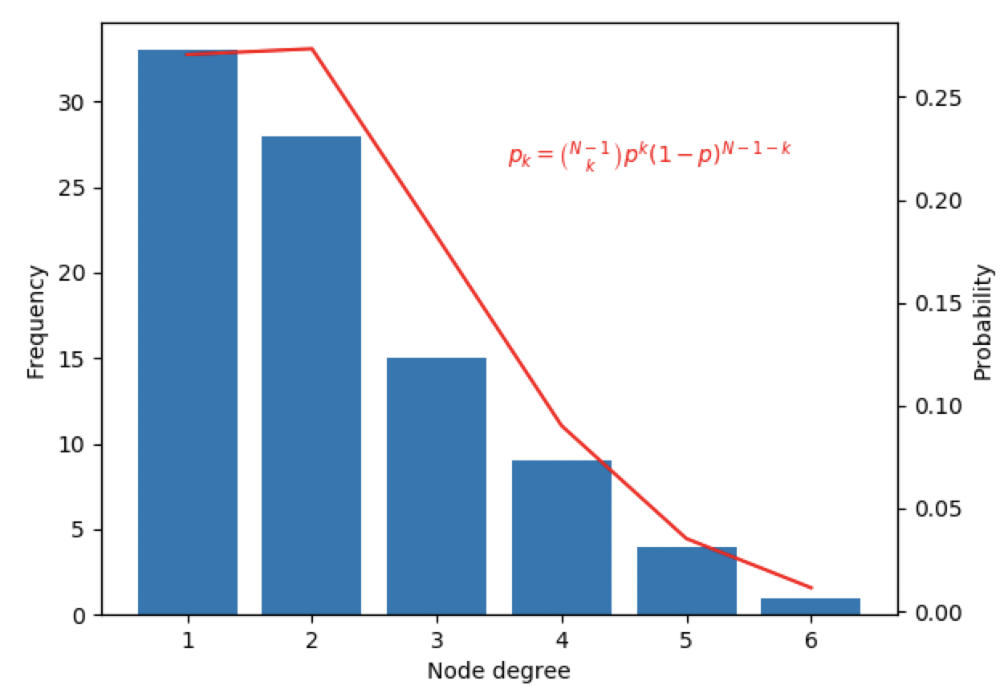
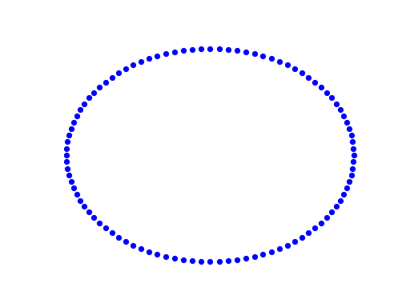

# Random Attachment Model

In a Random Attachment Model, we begin with a network of fully disconnected nodes, and then, at each timestep, we pick 
two nodes randomly, and form a connection between them if they are not already connected. This is essentially the 
Erdős–Rényi model.

An example of a Random Attachment Model implemented with Netomaton follows:

```python
import netomaton as ntm
import numpy as np

N = 100
network = ntm.topology.disconnected(N)

def topology_rule(ctx):
    nodes = [int(i) for i in np.random.choice(list(ctx.network.nodes), size=2, replace=False)]
    if not ctx.network.has_edge(nodes[1], nodes[0]) and not ctx.network.has_edge(nodes[0], nodes[1]):
        ctx.network.add_edge(nodes[1], nodes[0])
        ctx.network.add_edge(nodes[0], nodes[1])

    return ctx.network

trajectory = ntm.evolve(network=network,
                        topology_rule=topology_rule, timesteps=N)

# plot degree distribution
p = 2 / (N - 1)
ntm.plot_degree_distribution(trajectory[-1].network, out_degree=True,
                             equation=lambda k: ntm.ncr(N-1, k)*(p**k)*((1-p)**(N-1-k)),
                             equation_text="$p_{k} = \\binom{N-1}{k} p^k (1-p)^{N-1-k}$")

ntm.animate_network(trajectory, interval=350, with_labels=False)
```





The full source code for this example can be found [here](random_attachment_model_demo.py).

For more information, see:

> Newman, M. E., Strogatz, S. H., & Watts, D. J. (2001). Random graphs with arbitrary degree distributions and their applications. Physical Review E, 64(2), 026118.