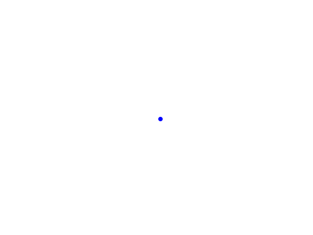
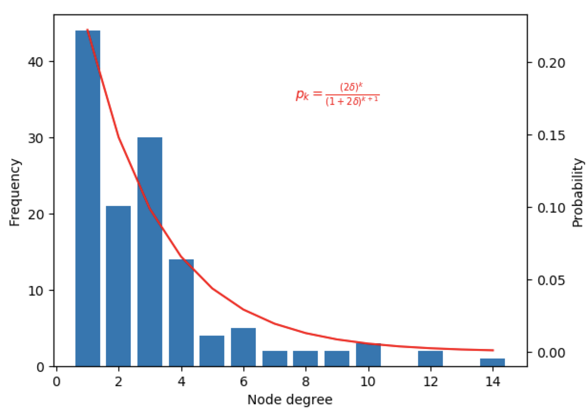

# Randomly Growing Network

One can grow a network randomly by starting with a single disconnected node, and then at each timestep, we add a new 
node and attach it randomly to the network. Nodes added earlier in the evolution have a greater probability of having a 
larger degree. 

The following implementation with the Netomaton framework demonstrates a randomly growing network:

```python
import netomaton as ntm
import numpy as np

network = ntm.topology.from_adjacency_matrix([[1]])  # begin with a single-node network

def topology_rule(ctx):
    num_nodes = len(ctx.network.nodes)
    new_label = num_nodes
    ctx.network.add_node(new_label)
    connect_to = int(np.random.choice(list(range(num_nodes))))
    ctx.network.add_edge(new_label, connect_to)
    ctx.network.add_edge(connect_to, new_label)

    return ctx.network

trajectory = ntm.evolve(initial_conditions=[1], network=network,
                        topology_rule=topology_rule, timesteps=100)

# animate time evolution of the network (NOTE: node self-links are not rendered)
ntm.animate_network(trajectory, interval=350, layout="spring", with_labels=False)
```



The full source code for this example can be found [here](randomly_growing_network_demo1.py).

In 2001, Callaway and colleagues analyzed the properties of a minimal model of a growing network. Much like the example 
above, they begin with a network with a single disconnected node, and at each timestep a new node is added, and with 
probability <i>δ</i>, two nodes are chosen uniformly at random and connected.  If the probability of attaching two nodes 
is <i>δ</i>, then the probability of a randomly chosen node have degree <i>k</i> is: 
<i>(2δ)<sup>k</sup> / (1 + 2δ)<sup>k+1</sup></i>. The following demonstrates an implementation of this model with the 
Netomaton framework:

```python
import netomaton as ntm
import numpy as np
import random

# probability of attaching two nodes
delta = 1.0

network = ntm.topology.disconnected(1)  # begin with a single-node network

def topology_rule(ctx):
    num_nodes = len(ctx.network.nodes)
    new_label = num_nodes
    ctx.network.add_node(new_label)
    if random.random() < delta:
        # choose 2 nodes at random, without replacement
        choices = [int(i) for i in np.random.choice(list(ctx.network.nodes), size=2, replace=False)]
        ctx.network.add_edge(choices[1], choices[0])
        ctx.network.add_edge(choices[0], choices[1])

    return ctx.network

trajectory = ntm.evolve(network=network, topology_rule=topology_rule, timesteps=200)

# plot degree distribution
ntm.plot_degree_distribution(trajectory[-1].network, out_degree=True,
                             equation=lambda k: ((2*delta)**k)/((1 + 2*delta)**(k+1)),
                             equation_text="$p_k = \\frac{(2\\delta)^k}{(1 + 2\\delta)^{k+1}}$")

# animate time evolution of the network (NOTE: node self-links are not rendered)
ntm.animate_network(trajectory, interval=350, layout="spring", with_labels=False)
```




The full source code for this example can be found [here](randomly_growing_network_demo2.py).

For more information, see:

> Jackson, M. O. (2010). Social and economic networks. Princeton university press. Chapter 5, "Growing Random Networks"

> Callaway, D. S., Hopcroft, J. E., Kleinberg, J. M., Newman, M. E., & Strogatz, S. H. (2001). Are randomly grown graphs really random?. Physical Review E, 64(4), 041902.
