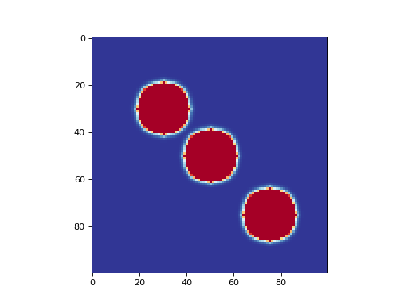

# Gray-Scott Reaction-Diffusion Model

This example attempts to demonstrate the Gray-Scott Reaction-Diffusion
model. The reactions are:

**U** + 2**V** -> 3**V**

**V** -> **P**

where **U**, **V**, and **P** represent the reactants. The time
evolution of the system is described by a pair of partial differential
equations.

This system is modelled here as a 2D continuous Cellular Automaton with a
von Neumann neighbourhood of radius 1. The state of a cell consists of
the tuple (*u*, *v*), where *u* is the concentration of **U**, and *v* is the
concentration of **V**. Both *u* and *v* assume continuous values between 0 and 1.
(The concentration of the decomposition product, **P**, is not explicitly
modelled.) This is an example of a system that is in a constant state
of disequilibrium: it is kept in chemical non-equilibrium by virtue of
the fact that the substrate is constantly being replenished.

The full source code for this example can be found [here](reaction_diffusion_demo.py).

More information:

> Pearson, John E. "Complex patterns in a simple system." Science 261.5118 (1993): 189-192.

> Froese, Tom, Nathaniel Virgo, and Takashi Ikegami. "Life as a process of open-ended becoming: Analysis of a minimal model." ECAL. 2011.
