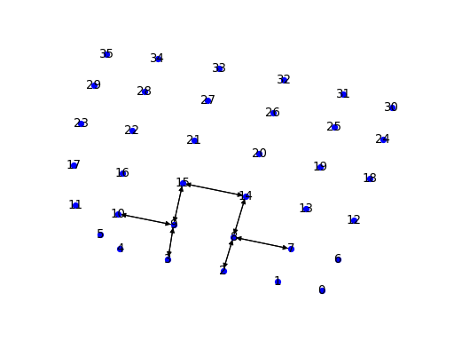

Restricted Network Automata
===========================

In 2011, David M. D. Smith and colleagues described Network Automata, a computational framework in which the topological 
evolution of a network is coupled to its structure. To demonstrate Network Automata, they implemented a model that 
utilizes dynamic network structure to realize the rules of Conway's Game of Life. The model belongs to a class of 
Network Automata that are restricted in the connections that can be formed, named Restricted Network Automata. An 
underlying network (which does not undergo evolution) specifies which connections can be made in the actual network.

An example of the Restricted Network Automata version of the Game of Life is given below:

```python
import networkx as nx
import netomaton as ntm

underlying_network = ntm.topology.lattice(dim=(1, 6, 6), periodic=True)
initial_network = ntm.Network(n=36)

# spaceship
initial_network.add_edge(9, 10)
initial_network.add_edge(10, 9)
initial_network.add_edge(3, 9)
initial_network.add_edge(9, 3)
initial_network.add_edge(15, 9)
initial_network.add_edge(9, 15)
initial_network.add_edge(15, 14)
initial_network.add_edge(14, 15)
initial_network.add_edge(8, 14)
initial_network.add_edge(14, 8)
initial_network.add_edge(2, 8)
initial_network.add_edge(8, 2)
initial_network.add_edge(7, 8)
initial_network.add_edge(8, 7)

def topology_rule(ctx):
    curr_network = ctx.network
    new_network = ctx.network.copy()
    for i in underlying_network.nodes:
        in_degree_i = curr_network.in_degree(i)
        for j in underlying_network.nodes:
            if i == j:
                continue
            in_degree_j = curr_network.in_degree(j)
            combined_in_degrees = in_degree_i + in_degree_j
            # a non-existent link will be “born” if the combined degrees of the
            #   two nodes between which it might exist is 2
            if combined_in_degrees == 2 and not curr_network.has_edge(j, i) and underlying_network.has_edge(j, i):
                new_network.add_edge(j, i)
            # a link will survive if the combined degree of the two nodes it connects is 3
            elif combined_in_degrees == 3 and curr_network.has_edge(j, i):
                pass
            # a link dies if it exists
            elif curr_network.has_edge(j, i):
                new_network.remove_edge(j, i)
    return new_network

trajectory = ntm.evolve(network=initial_network, topology_rule=topology_rule, timesteps=6)

pos = nx.spring_layout(ntm.topology.lattice(dim=(1, 6, 6), periodic=False).to_networkx())
ntm.animate_network(trajectory, layout=pos, interval=500)
``` 



The full source code for this example can be found [here](restricted_network_automata_demo.py).

For more information, see:

> Smith, David MD, et al. "Network automata: Coupling structure and function in dynamic networks." Advances in Complex Systems 14.03 (2011): 317-339.
