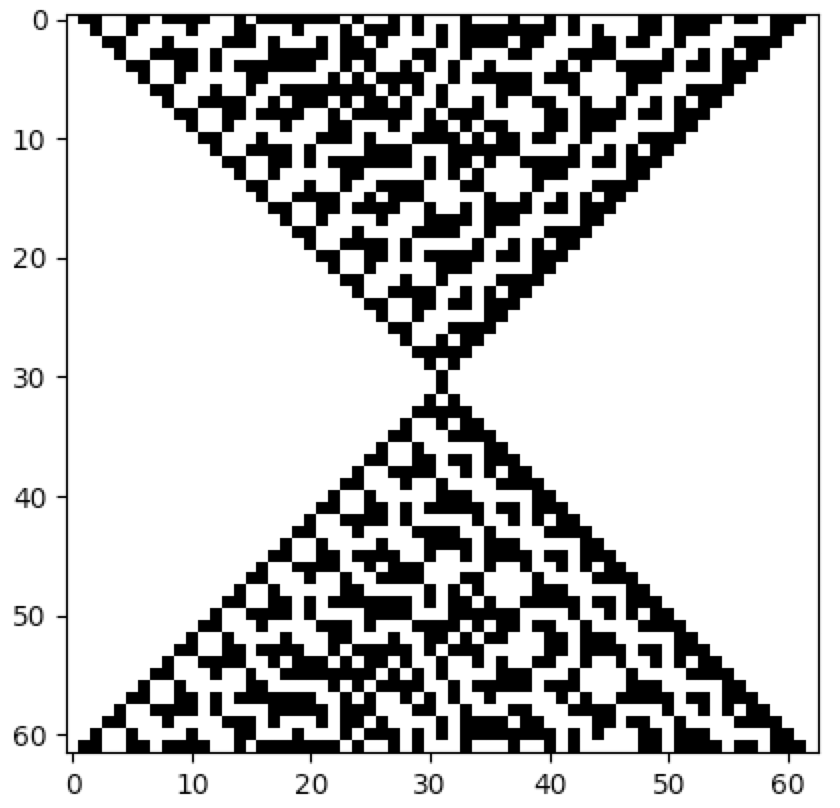
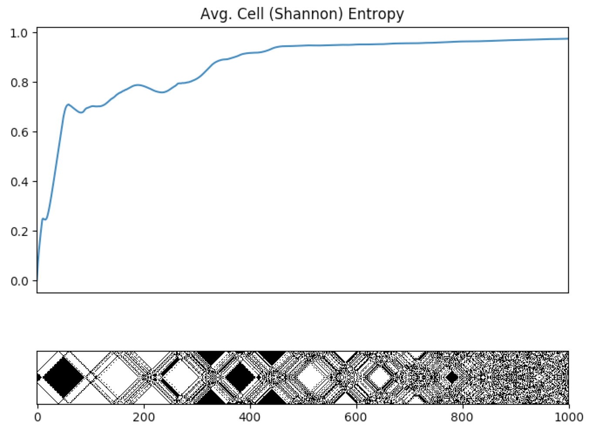
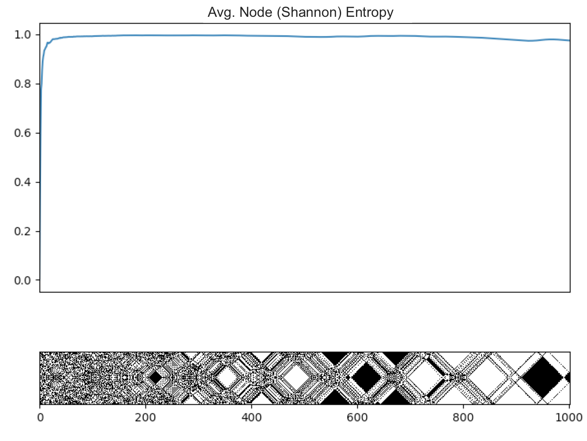

### Reversible 1D Cellular Automata

Network automata can be explicitly made to be reversible. The following example demonstrates the
creation of the elementary reversible cellular automaton rule 90R:

```python
from netomaton import *

adjacencies = AdjacencyMatrix.cellular_automaton(n=200)

initial_conditions = np.random.randint(0, 2, 200)

r = ReversibleRule(lambda n, c, t: ActivityRule.nks_ca_rule(n, c, 90))

activities, connectivities = evolve(initial_conditions, adjacencies, timesteps=100,
                                    activity_rule=r.activity_rule)

plot_grid(activities)
```


The full source code for this example can be found [here](reversible_ca_demo.py).

Another example of a cellular automaton that can be explicitly set up to be reversible is
rule 214R:



The patterns produced exhibit time reversal symmetry. This automaton was introduced on
page 437 of Wolfram's *New Kind of Science* (NKS), and the source code for the example can be
found [here](rule214R_demo.py).

The phenomenon of automata reversibility is useful when studying the concept of irreversibility and
the Second Law of Thermodynamics. The following cellular automata are described on pages
442 and 443 of NKS:



In the cellular automaton above, initial conditions represent a highly ordered state. The systems evolves
to increasingly disordered states, and, as expected, the entropy of the system increases with time.



The cellular automata above is carefully constructed so that it begins in
an apparently more disordered state, and evolves to something more ordered, contrary to what
we typically expect to observe in Nature.

The average cell Shannon entropies are also plotted in the two preceding figures,
and are computed using the built-in function `average_cell_entropy`. (Note that the cellular automata
along the bottom of the plots above describe the time evolution going from left-to-right instead
of the usual top-to-bottom.)

The source code for these examples can be found
[here](rule122R_entropy_demo.py) and
[here](rule122R_reverse_demo.py).
