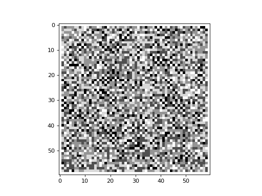

# Sandpiles

Netomaton offers an implementation of the Abelian sandpile model.

```python
sandpile = ntm.Sandpile(rows=60, cols=60)

initial_conditions = np.random.randint(5, size=3600)

def perturb(pctx):
    # drop a grain on some node at the 85th timestep
    if pctx.timestep == 85 and pctx.node_index == 1034:
        return pctx.node_activity + 1
    return pctx.node_activity

activities, _ = ntm.evolve(initial_conditions, sandpile.adjacency_matrix, timesteps=110,
                           activity_rule=sandpile.activity_rule, perturbation=perturb)

ntm.animate(activities, shape=(60, 60), interval=150)
```



The full source code for this example can be found [here](sandpile_demo.py).

See the following for more information on Abelian sandpile models:

> Bak, Per, Chao Tang, and Kurt Wiesenfeld. "Self-organized criticality." Physical review A 38.1 (1988): 364.