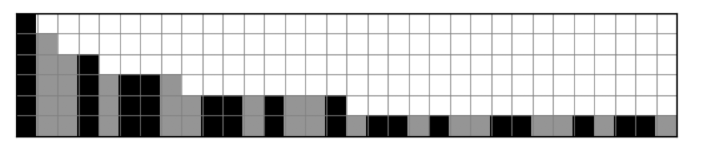
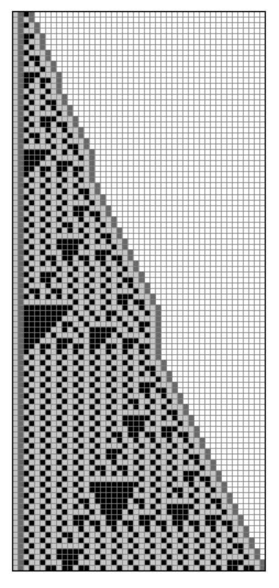

# Substitution Systems

Often, a complex system consists of network elements, or nodes, that remains fixed in number over the course of the 
evolution of the system. However, this isn't a requirement, and the number of elements in the system can change as 
the system evolves. Perhaps the simplest example of this scenario is the substitution system, which consists of an 
alphabet that forms a string, and a set of rules that state how the string changes over time through substitutions of 
its elements.

Although simple to describe, substitution systems can give rise to unpredictable and surprisingly complex behaviour. 
The examples of the substitution systems described here are derived from Stephen Wolfram's 
[A New Kind of Science](https://www.wolframscience.com/nks/p82--substitution-systems/). Netomaton supports the creation
of such substitution systems, through the `SubstitutionSystem` class.
 
An example of a substitution system is given below. It is a reproduction of the system on 
[page 82 (left) of NKS](https://www.wolframscience.com/nks/p82--substitution-systems/):

```python
import netomaton as ntm

system = ntm.SubstitutionSystem(rules={
    "2": "21",
    "1": "12"
}, axiom=[2])

trajectory = ntm.evolve(network=system.network,
                        initial_conditions=system.initial_conditions,
                        activity_rule=system.activity_rule, timesteps=6)

padded = system.pad(trajectory)

ntm.plot_grid(padded, show_grid=True)
```   



The full source code for this example can be found [here](substitution_system_demo1.py). See also the demos 
[here](substitution_system_demo2.py) and [here](substitution_system_demo3.py).

A more complex example is given below, and reproduces the system on page 
[87 (b) of NKS](https://www.wolframscience.com/nks/p87--substitution-systems/):

```python
import netomaton as ntm

system = ntm.SubstitutionSystem(rules={
    "33": "3",
    "32": "12",
    "31": "1",
    "23": "",
    "22": "",
    "21": "3",
    "13": "1",
    "12": "12",
    "11": "3"
}, axiom=[1, 2, 3, 2])

trajectory = ntm.evolve(network=system.network,
                        initial_conditions=system.initial_conditions,
                        activity_rule=system.activity_rule, timesteps=101)

padded = system.pad(trajectory)

ntm.plot_grid(padded, show_grid=True)
```



The full source code for this example can be found [here](substitution_system_demo5.py). See also the demo
[here](substitution_system_demo4.py).

For more information, see:

> https://www.wolframscience.com/nks/p82--substitution-systems/