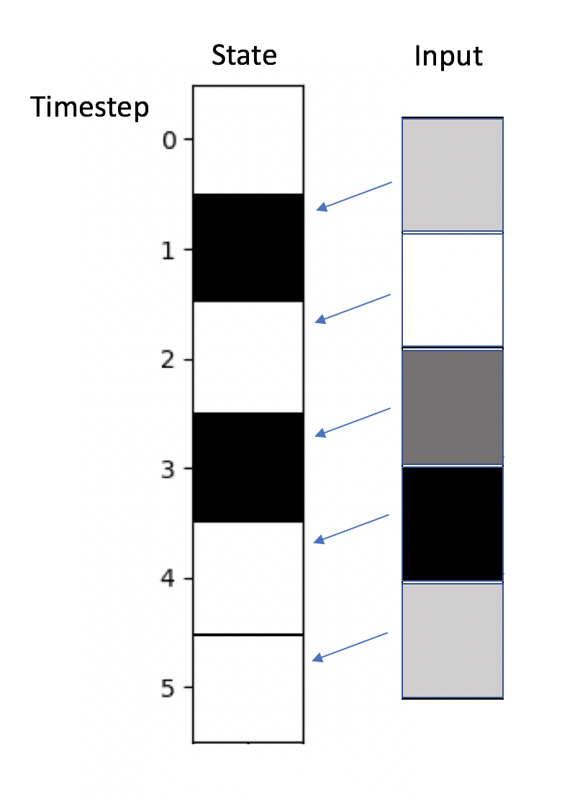

### Timesteps and Input

The Netomaton `evolve` function accepts two different parameters that
are used to specify how the network should be evolved: the `timesteps`
parameter and the `input` parameter.

The `timesteps` parameter specifies the number of times the activity
rule should be applied to the network as a whole. That is, one cycle of
activity is defined as the application of the activity rule once to each
node in the network. The `timesteps` parameter therefore specifies the
number of cycles.* Specifying the timesteps implies an
automaton that evolves on its own, in the absence of any external
driving signal.

The `input` parameter specifies the input to the network at a particular
step in the network's evolution. It is either a list, where each item in
the list contains the input for each node in the network for a
particular step in its evolution, or a function that accepts the current
timestep number and returns either the input for that timestep or None,
to signal the end of the evolution. The `input` parameter thus specifies
both the input to the network and, implicitly, the number of timesteps
in its evolution. The input for each node at each timestep will be
provided to the `activity_rule` function (and any `perturbation`
function), when the function is invoked. Specifying the input implies an
automaton whose evolution is driven by an external signal.

Either the `input` or the `timesteps` parameter must be provided to the
`evolve` function, but not both. If the `input` parameter is provided,
it will override the `timesteps` parameter, and the `timesteps`
parameter will have no effect.

The first item in the `input` list is given to the network at _t_=1,
the second at _t_=2, etc. No input is specified for the initial
state. This is illustrated in the figure below:

An example of the use of the `input` parameter in the form of a list can
be seen in the [Finite State Machine demo](../finite_state_machine/README.md).
An example of the use of the `input` parameter in the form of a function
can be seen in the [Turing Machine demo](../turing_machine/README.md).
An example of the use of the `timesteps` parameter can be seen in the
[Elementary Cellular Automata demo](../elementary_ca/README.md).

* <em>Note that the initial state, specified by the
`initial_conditions`, is considered the result of a timestep, so that
the `activity_rule` is actually invoked</em> t - 1 <em>times.</em>
