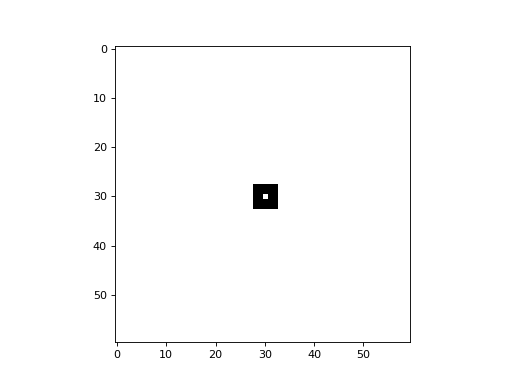

# 2D Cellular Automata

Netomaton supports 2-dimensional Cellular Automata with periodic
boundary conditions. The number of states, k, can be any whole number.
The neighbourhood radius, r, can also be any whole number, and both
Moore and von Neumann neighbourhood types are supported. The following
snippet demonstrates creating a 2D totalistic Cellular Automaton:

```python
import netomaton as ntm

adjacency_matrix = ntm.network.cellular_automaton2d(rows=60, cols=60, r=1, neighbourhood='Moore')

initial_conditions = ntm.init_simple2d(60, 60)

activities, _ = ntm.evolve(initial_conditions, adjacency_matrix, timesteps=30,
                           activity_rule=ntm.rules.totalistic_ca(k=2, rule=126))

ntm.plot_grid(activities, shape=(60, 60))
```

The full source code can be found [here](totalistic_2d_demo.py).


