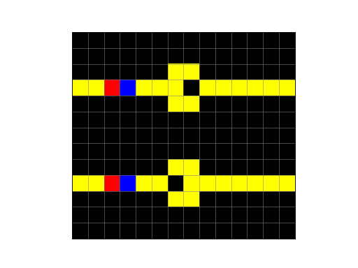
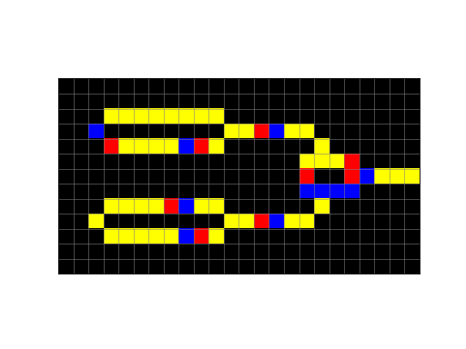

# Wireworld

Wireworld is a Turing-complete Cellular Automaton, first described by
Brian Silverman in 1987. Wireworld can be used to simulate electronic
gates, or logic elements.

An example of Wireworld diodes is given below:
```python
import netomaton as ntm
from matplotlib.colors import ListedColormap

network = ntm.topology.cellular_automaton2d(rows=13, cols=14, neighbourhood="Moore")

initial_conditions = [
    0, 0, 0, 0, 0, 0, 0, 0, 0, 0, 0, 0, 0, 0,
    0, 0, 0, 0, 0, 0, 0, 0, 0, 0, 0, 0, 0, 0,
    0, 0, 0, 0, 0, 0, 3, 3, 0, 0, 0, 0, 0, 0,
    2, 1, 3, 3, 3, 3, 3, 0, 3, 3, 3, 3, 3, 3,
    0, 0, 0, 0, 0, 0, 3, 3, 0, 0, 0, 0, 0, 0,
    0, 0, 0, 0, 0, 0, 0, 0, 0, 0, 0, 0, 0, 0,
    0, 0, 0, 0, 0, 0, 0, 0, 0, 0, 0, 0, 0, 0,
    0, 0, 0, 0, 0, 0, 0, 0, 0, 0, 0, 0, 0, 0,
    0, 0, 0, 0, 0, 0, 3, 3, 0, 0, 0, 0, 0, 0,
    2, 1, 3, 3, 3, 3, 0, 3, 3, 3, 3, 3, 3, 3,
    0, 0, 0, 0, 0, 0, 3, 3, 0, 0, 0, 0, 0, 0,
    0, 0, 0, 0, 0, 0, 0, 0, 0, 0, 0, 0, 0, 0,
    0, 0, 0, 0, 0, 0, 0, 0, 0, 0, 0, 0, 0, 0
]

trajectory = ntm.evolve(initial_conditions=initial_conditions, network=network, timesteps=15,
                            activity_rule=ntm.rules.wireworld_rule)

ntm.animate_activities(trajectory, shape=(13, 14), interval=120, show_grid=True, show_margin=False, scale=0.3,
                       colormap=ListedColormap(["black", "blue", "red", "yellow"]))
```


The full source code for this example can be found [here](wireworld_diodes_demo.py).

An example of a Wireworld XOR gate is given below:
```python
import netomaton as ntm
from matplotlib.colors import ListedColormap

network = ntm.topology.cellular_automaton2d(rows=13, cols=24, neighbourhood="Moore")

initial_conditions = [
    0, 0, 0, 0, 0, 0, 0, 0, 0, 0, 0, 0, 0, 0, 0, 0, 0, 0, 0, 0, 0, 0, 0, 0,
    0, 0, 0, 0, 0, 0, 0, 0, 0, 0, 0, 0, 0, 0, 0, 0, 0, 0, 0, 0, 0, 0, 0, 0,
    0, 0, 0, 3, 3, 3, 3, 3, 3, 3, 3, 0, 0, 0, 0, 0, 0, 0, 0, 0, 0, 0, 0, 0,
    0, 0, 3, 0, 0, 0, 0, 0, 0, 0, 0, 2, 1, 3, 3, 3, 3, 0, 0, 0, 0, 0, 0, 0,
    0, 0, 0, 3, 1, 2, 3, 3, 3, 3, 1, 0, 0, 0, 0, 0, 0, 2, 0, 0, 0, 0, 0, 0,
    0, 0, 0, 0, 0, 0, 0, 0, 0, 0, 0, 0, 0, 0, 0, 0, 1, 1, 1, 3, 0, 0, 0, 0,
    0, 0, 0, 0, 0, 0, 0, 0, 0, 0, 0, 0, 0, 0, 0, 0, 3, 0, 0, 3, 3, 3, 3, 2,
    0, 0, 0, 0, 0, 0, 0, 0, 0, 0, 0, 0, 0, 0, 0, 0, 3, 3, 3, 3, 0, 0, 0, 0,
    0, 0, 0, 3, 3, 2, 1, 3, 3, 3, 3, 0, 0, 0, 0, 0, 0, 3, 0, 0, 0, 0, 0, 0,
    0, 0, 3, 0, 0, 0, 0, 0, 0, 0, 0, 2, 1, 3, 3, 3, 3, 0, 0, 0, 0, 0, 0, 0,
    0, 0, 0, 3, 3, 3, 3, 3, 3, 3, 1, 0, 0, 0, 0, 0, 0, 0, 0, 0, 0, 0, 0, 0,
    0, 0, 0, 0, 0, 0, 0, 0, 0, 0, 0, 0, 0, 0, 0, 0, 0, 0, 0, 0, 0, 0, 0, 0,
    0, 0, 0, 0, 0, 0, 0, 0, 0, 0, 0, 0, 0, 0, 0, 0, 0, 0, 0, 0, 0, 0, 0, 0
]

trajectory = ntm.evolve(initial_conditions=initial_conditions, network=network, timesteps=25,
                            activity_rule=ntm.rules.wireworld_rule)

ntm.animate_activities(trajectory, shape=(13, 24), interval=120, show_grid=True, show_margin=False, scale=0.3,
                       colormap=ListedColormap(["black", "blue", "red", "yellow"]))
```



The full source code for this example can be found [here](wireworld_xor_demo.py).

For more information, please refer to the following resources:

https://en.wikipedia.org/wiki/Wireworld

> Dewdney, A K (January 1990). "Computer recreations: The cellular automata programs that create Wireworld, Rugworld and other diversions". Scientific American. 262 (1): 146–149.